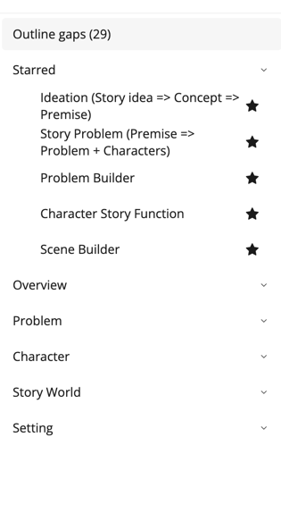

# A Path to Try

The [Workflow Reference](../Workflows/) describes every workflow Collaborator offers, and you do not need all of them on day one. The path below matches the craft order in [Writing with StoryCAD](../../Writing%20with%20StoryCAD/Writing_with_StoryCAD.html): idea and premise first, then the problem and the characters who carry it, then structure and scenes. You can skip steps, and nothing stops you running a scene workflow first, but this order usually wastes less time, because each workflow reads what the ones before it wrote.

## The starred band is a head start

Collaborator starts with five workflows starred, so they sit at the top of the workflow list before you touch anything: Ideation (Story idea => Concept => Premise), Story Problem (Premise => Problem + Characters), Problem Builder, Character Builder, and Scene Builder. That is one for each stage of the path below, so the top of the list reads as a next step rather than a catalog.

Treat it as a starting point, not a rule. As you learn which workflows your writing turns on, star those and unstar the rest; [Opening Collaborator](../Opening_Collaborator.html) shows how. Everything that is not starred is still there, filed under its story element.

## Suggested order

1. Ideation (Story idea => Concept => Premise). Nail a workable premise from your idea and concept. Craft: [Story Idea, Concept, and Premise](../../Writing%20with%20StoryCAD/Story_Idea_Concept_and_Premise.html).

2. Story Form, when you care about it. Genre and story type, novel or screenplay and so on, are quick to set by hand, and this workflow is useful once the premise exists and you have a sense of the story's size.

3. Story Problem (Premise => Problem + Characters). Turn the premise into a main problem with a protagonist and an antagonist, each created as a character if you do not have them yet. Craft: [Defining Problems](../../Writing%20with%20StoryCAD/Defining_Problems.html).

4. Problem Builder. Goal, motivation, and conflict for both sides of that problem, then a beat sheet that fits it. Scenes and problems that sit on no beat sheet yet fill its empty beats, and scene stubs fill the rest. Set Problem Category, Protagonist, and Antagonist on the Problem first; Problem Builder reads all three, and a blank category stops the run before it starts. Craft: [Defining Problems](../../Writing%20with%20StoryCAD/Defining_Problems.html) for goal, motivation, and conflict, and [Plotting with StoryCAD](../../Writing%20with%20StoryCAD/Plotting_with_StoryCAD.html) for structure.

5. Inner and Outer Problems. The protagonist's outer want against their inner need, as a second Problem built from the first. Craft: the outer and inner problems section of Defining Problems.

6. One character path. Character Builder first, then Flaw and Backstory, on the protagonist or the antagonist. Craft: [Defining Characters](../../Writing%20with%20StoryCAD/Defining_Characters.html).

7. Scene Builder. Sketch, type, cast, development, conflict, and sequel for one scene. Select a scene you already have, such as a stub Problem Builder created, or run it on the story problem (the Spine). Craft: [Defining Scenes](../../Writing%20with%20StoryCAD/Defining_Scenes.html) and [Plotting in Scenes](../../Writing%20with%20StoryCAD/Plotting_in_Scenes.html).

## For teachers

For a class or a critique group, assign one workflow per session and ask students to accept or skip each proposed field deliberately, with a reason. The point of the exercise is the judgment, not the speed, and a student who can say why a proposed goal is wrong for the character has learned something about goals.

## What to leave for later

The workflows not on this path, Character Interview, Character Relationship, Define Story World, and Setting Builder, can wait until the path above feels solid. A short list of workflows that improve a story beats a long menu tried once each, and leaving the others unstarred keeps them out of your way without putting them out of reach.
