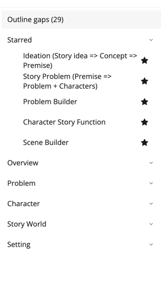

# A Path to Try

Collaborator has thirteen workflows. You do not need all of them on day one. The path below matches the craft order in [Writing with StoryCAD](../../Writing%20with%20StoryCAD/Writing_with_StoryCAD.html): idea and premise first, then problem and character force, then structure and scenes.

You can skip steps, but this order usually wastes less time.

## The starred band is a head start

Collaborator starts with five of these workflows starred, so they sit at the top of the workflow list before you touch anything: **Premise**, **Story Problem**, **Problem Builder**, **Character Story Function**, and **Scene Builder**. That is one per stage of the spine below, so the top of the list reads as a next step rather than a catalog.

Treat it as a starting point, not a rule. As you learn which workflows your writing turns on, star those and unstar the rest. [Opening Collaborator](../Opening_Collaborator.html) shows how. Everything not starred is still there, filed under its story element.

## Suggested order

1. **Premise**  
   Nail a workable premise from idea and concept.  
   Craft: [Story Idea, Concept, and Premise](../../Writing%20with%20StoryCAD/Story_Idea_Concept_and_Premise.html)

2. **Story Form** (when you care)  
   Genre and story type (novel, screenplay, and so on). Useful once the premise exists.

3. **Story Problem**  
   Turn the premise into a main problem with protagonist and antagonist shells.  
   Craft: [Defining Problems](../../Writing%20with%20StoryCAD/Defining_Problems.html)

4. **Problem Builder**  
   Goal, motivation, and conflict for both sides of that problem, then a beat sheet that fits it and scene stubs for the empty beats. Set Problem Category, Protagonist, and Antagonist on the Problem first: Problem Builder reads all three, and a blank category stops the run before it starts.  
   Craft: [Defining Problems](../../Writing%20with%20StoryCAD/Defining_Problems.html) (GMC), [Plotting with StoryCAD](../../Writing%20with%20StoryCAD/Plotting_with_StoryCAD.html)

5. **Inner and Outer Problems**  
   Outer want versus inner need.  
   Craft: outer and inner problems in the same Defining Problems material

6. **One character path**  
   For example **Character Story Function**, then **Flaw and Backstory**.  
   Craft: [Defining Characters](../../Writing%20with%20StoryCAD/Defining_Characters.html)

7. **Scene Builder**  
   Sketch, type, cast, development, conflict, and sequel for one scene. Select the scene first: Scene Builder fills a scene you already made, and does not run on the story problem itself.  
   Craft: [Defining Scenes](../../Writing%20with%20StoryCAD/Defining_Scenes.html), [Plotting in Scenes](../../Writing%20with%20StoryCAD/Plotting_in_Scenes.html)

## Teaching tip

For a class or critique group, assign *one* workflow per session and require students to accept or reject each field deliberately. The point is judgment, not speed.

## What to leave for later

Image-generation workflows, deep redesigns, and specialty tools can wait until the spine above feels solid. A short list of workflows that actually improve a story beats a long menu of experiments. Leaving them unstarred keeps them out of your way without putting them out of reach.
