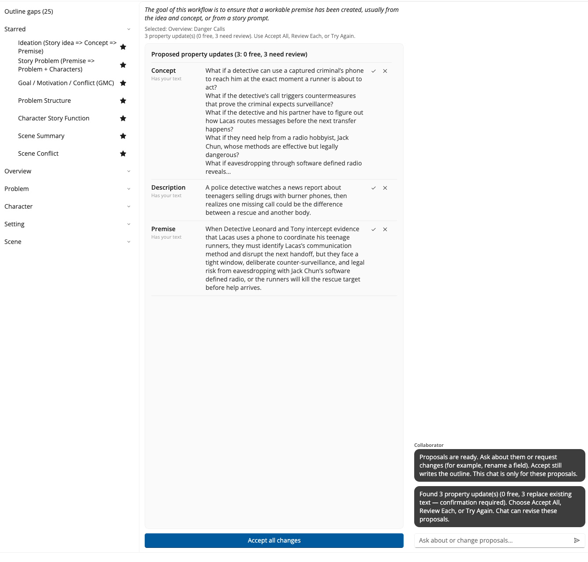
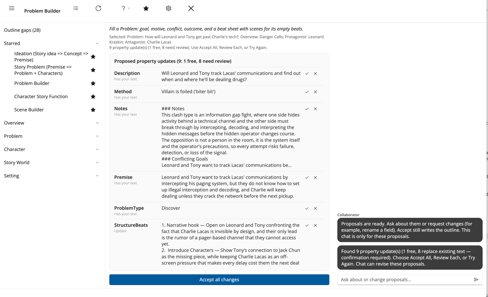

# An Example Session

This walkthrough is short enough for a class period or a first evening with Collaborator.

You can follow it exactly, because the outline it uses ships with StoryCAD. **Danger Calls** is a suspense short story about two detectives, Leonard Kraskin and Tony Irwin, trying to catch a drug dealer whose pager network keeps him a step ahead of them. Open it from **Sample Stories** on the left tab of the open dialog, described in [Reading and Writing Outlines](../../Quick%20Start/Reading_and_Writing_Outlines.html).

It is also the story the manual builds from nothing in [Tutorial Creating a Story](../../Tutorial%20Creating%20a%20Story/Tutorial_Creating_a_Story.html). If you have worked through that, you already know this outline; if you have not, you do not need to.

**Save a copy before you start.** Accepting a suggestion writes it to the outline as you accept it, so work on your own copy rather than the installed sample.

Danger Calls is partly filled in, which is the interesting case. Collaborator will not overwrite your words without asking, so an outline with text already in it is where you learn what the controls actually do. On an emptier outline, expect more proposals to apply straight away and fewer to stop and ask.

## 1. Start

1. Open your copy of Danger Calls.  
2. Select **Danger Calls** at the top of the Story Explorer to see the Overview.  
3. Click **Collaborator** on the toolbar.

Collaborator reads what is there. Empty forms produce empty-sounding help.

## 2. Premise

1. Click the **Premise** workflow. The list shows it as a longer ideation label. Clicking runs it straight away.  
2. Wait for it to finish.  
3. Read the header above the list. It counts the proposals and splits them into free and need review.

Danger Calls already has a Story Idea (a news piece about teenagers selling drugs using disposable phones) and a Concept (what if a detective uses a criminal's own phone to stage a rescue). Fields carrying that text come back marked **Has your text**, and **Accept all changes** leaves every one of them alone. That is the point: nothing you wrote disappears because you clicked the big blue button.

4. Use **Review Each** and read one properly. Compare **Yours** against **Proposed**, then Accept or Skip.

Return to StoryCAD and open the Overview. Anything you accepted is already there.

**Craft check:** Does the premise name someone who wants something, and what stands in their way? Danger Calls has both: the detectives need to know when and where Lacas will deal, and his pager network is what stops them. See [Story Idea, Concept, and Premise](../../Writing%20with%20StoryCAD/Story_Idea_Concept_and_Premise.html).

## 3. Problem Builder on a problem

Danger Calls carries three problems. **How will Leonard and Tony get past Charlie's tech?** is the useful one to work on: Leonard Kraskin against Charlie Lacas, over whether the detectives can read his pager traffic before the next deal.

Set **Problem Category**, **Protagonist**, and **Antagonist** on that Problem first. Problem Builder reads all three, and it stops before it starts if the category is blank.

1. Run **Problem Builder** on that problem.  
2. If Collaborator needs a character it opens a picker. Choose an existing one, or **Create a new element** if the person you want is not there yet. Cancelling the picker stops the run.  
3. Read the label under each field name.

Problem Builder takes four elements at once, which you can see on the **Selected** line: the Problem, the Overview, and both sides of the cast. It fills the problem's spine and chooses a beat sheet in the same pass, so **StructureBeats** arrives alongside Premise and ProblemType rather than in a second run.

On the sample it proposes nine updates and eight of them already have your text, so those eight stop and ask. That is the slow path on purpose: eight replacements at once is exactly when you want to read before accepting.

4. Use **Review Each** on at least one row. Read **Yours** against **Proposed**, then Accept or Skip deliberately.  
5. Use **Accept Free Remaining** for anything left that does not need review.

Return to StoryCAD and open that Problem. Anything you accepted is already sitting in its fields, and the beat sheet is on the **Structure** tab.

**Craft check:** Can you state what the protagonist wants, why, and what opposes them? Same for the antagonist? See [Defining Problems](../../Writing%20with%20StoryCAD/Defining_Problems.html).

## 4. Optional next beat

If you have time, run one more. **Flaw and Backstory** on Charlie Lacas is a good second look: an antagonist is easier to write when you know what made him, and the workflow proposes the wound and the history together. **Scene Builder** on one of the story's scenes works too, and behaves differently from the Overview workflows.

One more workflow is enough for a first session.

## 5. Close the loop

**Exit** Collaborator. Everything you accepted is already in your outline, and anything you skipped never touched it.

That is a full loop: workflow, suggestions, your judgment, outline updated.

## What you should notice

- You stayed in charge. Every replacement was one you approved.  
- Empty fields fill in bulk; fields with your words in them stop and ask.  
- One workflow equals one craft question, not "write my book."  
- Chat is optional. Nothing above required it.

For a longer curriculum path, see [A Path to Try](A_Path_to_Try.html).
