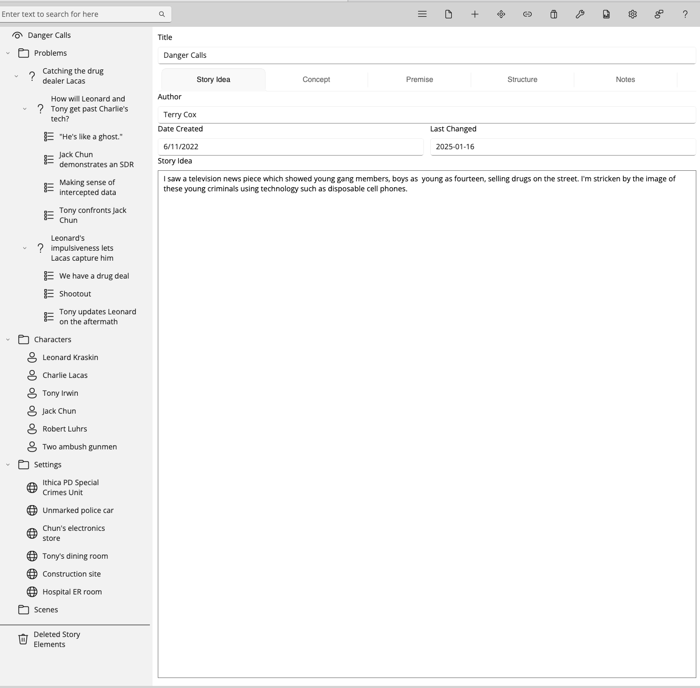

# An Example Session

This walkthrough is short enough for a class period or a first evening with Collaborator, and you can follow it exactly, because the outline it uses ships with StoryCAD. Danger Calls is a suspense short story about two detectives, Leonard Kraskin and Tony Irwin, trying to catch a drug dealer whose pager network keeps him a step ahead of them. Open it from Sample Stories on the left tab of the open dialog, as described in [Reading and Writing Outlines](../../Quick%20Start/Reading_and_Writing_Outlines.html). It is also the story the manual builds from nothing in [Tutorial Creating a Story](../../Tutorial%20Creating%20a%20Story/Tutorial_Creating_a_Story.html); if you have worked through that, you already know this outline, and if you have not, you do not need to.

Save a copy before you start. Accepting a suggestion writes it to the outline as you accept it, so work on your own copy rather than the installed sample.

Danger Calls is partly filled in, which is the interesting case. Collaborator will not overwrite your words without asking, so an outline with text already in it is where you learn what the controls do. On an emptier outline, expect more proposals to apply straight away and fewer to stop and ask.

## 1. Start

Open your copy of Danger Calls and select Danger Calls at the top of the Story Explorer, so that the Overview is showing. Then click **Collaborator** on the toolbar. Collaborator reads what is there when it opens, and an outline with something on its Overview gives it something to work from; empty forms produce empty-sounding help.

## 2. Ideation (Story idea => Concept => Premise)

Click the **Ideation (Story idea => Concept => Premise)** workflow in the list. Clicking runs it straight away, so wait for it to finish, then read the header above the Property Updates list. It counts the proposals and splits them into free and need review.

Danger Calls already has a Story Idea (a news piece about teenagers selling drugs using disposable phones) and a Concept (what if a detective uses a criminal's own phone to stage a rescue). Fields carrying that text come back marked Has your text, and Accept all changes leaves every one of them alone. That is the point of the labels: nothing you wrote disappears because you clicked the button at the foot of the list.

Click **Review Each** and read one proposal properly. Compare Yours against Proposed, then Accept or Skip. Afterward, return to StoryCAD and open the Overview; anything you accepted is already there.

A craft check before you move on: does the premise name someone who wants something, and what stands in their way? Danger Calls has both. The detectives need to know when and where Lacas will deal, and his pager network is what stops them. [Story Idea, Concept, and Premise](../../Writing%20with%20StoryCAD/Story_Idea_Concept_and_Premise.html) explains what a premise should carry.

## 3. Problem Builder on a problem

Danger Calls carries three problems, and the useful one to work on is How will Leonard and Tony get past Charlie's tech? It sets Leonard Kraskin against Charlie Lacas over whether the detectives can read his pager traffic before the next deal. Before you run anything, set the Problem Category, Protagonist, and Antagonist on that Problem in StoryCAD. Problem Builder reads all three, and it stops before it starts if the category is blank.

Click **Problem Builder** and choose that problem in the picker. If Collaborator needs a character it has no link to, it opens a second picker; choose an existing one, or use Create a new element if the person you want is not there yet. Cancelling a picker stops the run.

Problem Builder takes four elements at once, which you can see on the Selected line: the Problem, the Overview, and both sides of the cast. It fills the problem's goal, motivation, conflict, and outcome and chooses a beat sheet in the same pass, so the beat sheet for the Structure tab arrives alongside the Premise and the Problem Type rather than in a second run. On the sample it proposes nine updates, and eight of them already have your text, so those eight stop and ask. That is the slow path on purpose: eight replacements at once is exactly when you want to read before accepting.

Use Review Each on at least one row, reading Yours against Proposed, then Accept or Skip deliberately. Use Accept Free Remaining for anything left that does not need review. Then return to StoryCAD and open that Problem: anything you accepted is sitting in its fields, and the beat sheet is on the Structure tab.

The craft check here is whether you can state what the protagonist wants, why, and what opposes them, and the same for the antagonist. [Defining Problems](../../Writing%20with%20StoryCAD/Defining_Problems.html) is the chapter to read if either answer comes slowly.

## 4. An optional next step

If you have time, run one more. Flaw and Backstory on Charlie Lacas is a good second look, because an antagonist is easier to write when you know what made him, and the workflow proposes the wound and the history together. Scene Builder on one of the story's scenes works too, and it behaves differently from the Overview workflows, since it asks you to pick the scene first. One more workflow is enough for a first session.

## 5. Close the loop

Click **Exit** to close Collaborator. Everything you accepted is already in your outline, and anything you skipped never touched it. That is the full loop: a workflow, its suggestions, your judgment, and an updated outline.

## What you should notice

You stayed in charge throughout; every replacement was one you approved. Empty fields filled in bulk, and fields with your words in them stopped and asked. Each workflow answered one craft question rather than trying to write the book, and chat was optional: nothing above required it. For a longer path through the workflows, see [A Path to Try](A_Path_to_Try.html).
