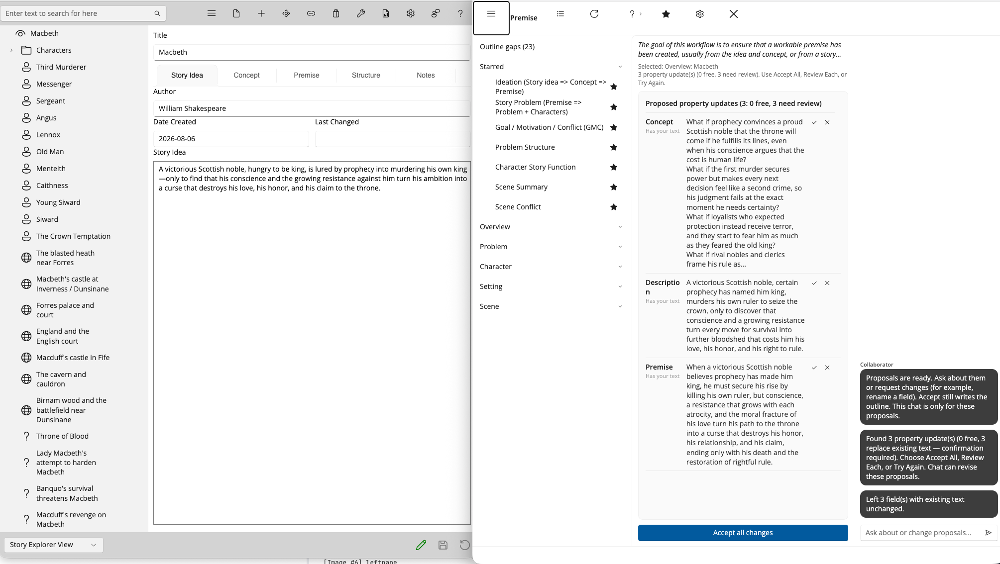

# What Collaborator Is

StoryCAD helps you build a fiction outline from story elements: the Story Overview, Problems, Characters, Settings, and Scenes. Each is a form with tabs and fields, and you fill them in until the story is clear enough to draft. The [Writing with StoryCAD](../Writing%20with%20StoryCAD/Writing_with_StoryCAD.html) chapters explain the craft behind each form.

StoryCAD Collaborator is an addition to StoryCAD that works on that outline with you. You choose a workflow, one job of story development such as turning an idea into a premise or filling in a character's flaw and backstory. Collaborator reads the story elements that job needs, suggests wording for particular fields on them, and waits. Nothing is written into your outline until you accept a suggestion, and you can accept some, skip others, or throw the whole run away. The outline stays yours.

## What it is good for

Collaborator is strongest in the stages StoryCAD is built for, because its workflows are organized around the same story elements as the manual's craft chapters. It can help you turn a rough idea into a workable premise, define the story problem and the forces on each side of it, deepen a problem's goal, motivation, and conflict, separate the protagonist's outer want from their inner need, choose a beat sheet and fill its beats, and fill out characters, settings, and scenes one workflow at a time. The [Workflow Reference](Workflows/) describes each of those jobs.

If you teach writing, each run is a short exercise: one craft question, applied to this student's outline, with an answer the student has to judge before it goes in.

## What it is not

Collaborator does not write your story. It works at the outline level, on the fields of your story elements, and it does not produce chapters, scene prose, or dialogue. The Foundation's AI usage policy states the boundary in three words, "Structure, not prose," and the workflows are built to stay on the structure side of it. If you want a machine to draft your novel, this is not that machine.

It is not a substitute for craft. Collaborator assumes you know what a premise is for and can tell a good goal from a vague one, because every suggestion it makes is only as useful as your judgment of it. The craft chapters in this manual, the books and classes they draw on, and StoryBuilder's [resources](https://storybuilder.org/resources/) and [learn](https://storybuilder.org/learn/) pages still matter. Collaborator is a way to apply what you know, not a way to skip learning it.

It does not act on your outline by itself. A suggestion is a proposal in a list, and it stays there until you accept it. A field that already holds your words is marked Has your text, and Accept all changes leaves every such field alone; you have to review those one at a time and choose to replace your text. When you close Collaborator, anything you did not accept is gone. [Reviewing Suggestions](Reviewing_Suggestions.html) explains these protections in detail.

It is not a library of other people's books. Collaborator does not store, index, or search published works, and it does not pull from or reference particular novels. The models behind it were trained on broad collections of text from the internet, as every current AI model was, and the policy is candid that this may include copyrighted works; because Collaborator works on structure rather than prose, the chance of copyrighted material appearing in a suggestion is low, but the Foundation does not claim it is zero.

It does not keep your work. Your outline is read for the run and not stored by the Foundation, and it is not used to train anything. You do not set up or pay for a separate AI account; Collaborator handles the AI service through StoryCAD.

It is not a guarantee. Suggestions can be wrong, thin, or slanted by biases in the text the models learned from, and the policy asks you to review them with a critical eye. What you accept into your outline and how you represent your work to others is your responsibility, and publishers, agents, contests, and writers' organizations increasingly have rules about AI that you are expected to know and follow.

## The Foundation's AI usage policy

StoryBuilder Foundation publishes its [AI Usage Policy](https://storybuilder.org/ai-usage-policy/) on storybuilder.org, and using Collaborator means accepting it. Its first principle is ownership: "You keep complete ownership of everything you create with our tools, including all intellectual property rights." The others are that AI assists and you create, that you should be open about AI's role in your work, and that the Foundation follows the law on privacy, intellectual property, and AI, and expects you to.

The policy also explains how Collaborator works with your information, in more detail than this page, and it lists examples of third-party AI rules: publishers that bar their books from AI training, contests that bar AI-generated narrative, and organizations that require disclosure of AI use in award nominations. Its advice before you submit work anywhere is to read that venue's AI policy, understand what level of AI involvement it permits, and disclose your use of AI tools as it requires. StoryCAD itself uses no AI; that distinction is in the policy too, and it is why the outline you build by hand and the fields Collaborator proposes are both yours to account for.

## When to type yourself, and when to open Collaborator

Type yourself when you already know what you want in a field, or when you are brainstorming free-form notes; a workflow adds nothing to a decision you have already made. Open Collaborator when you are stuck on a craft problem, when you want a structured pass over the empty fields of an element, or when you want a second take on wording that you can still refuse.

