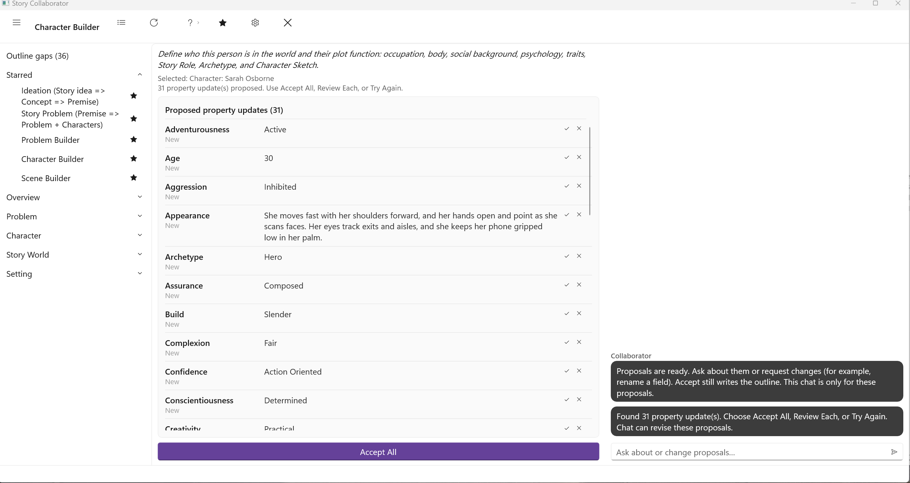
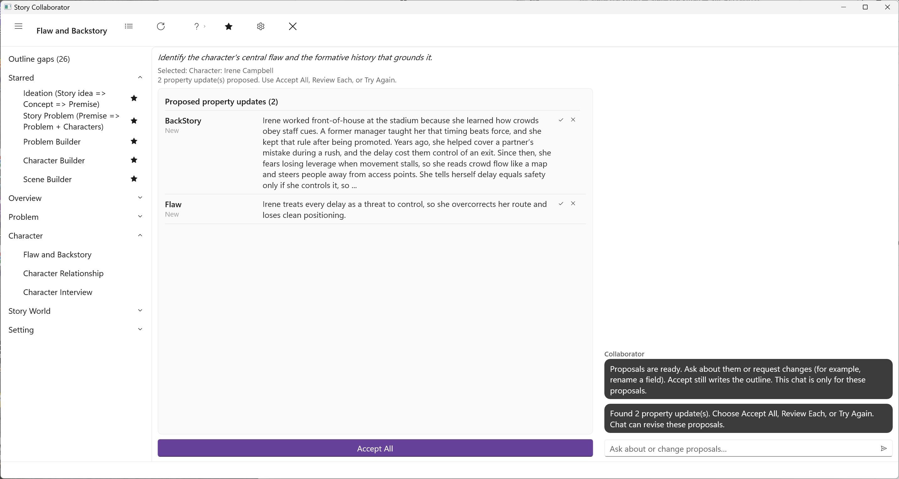
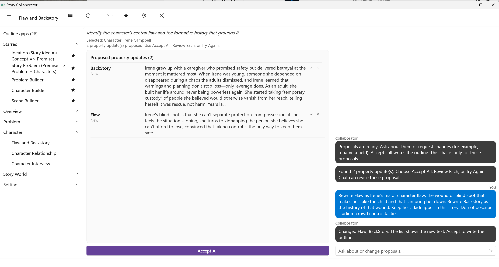
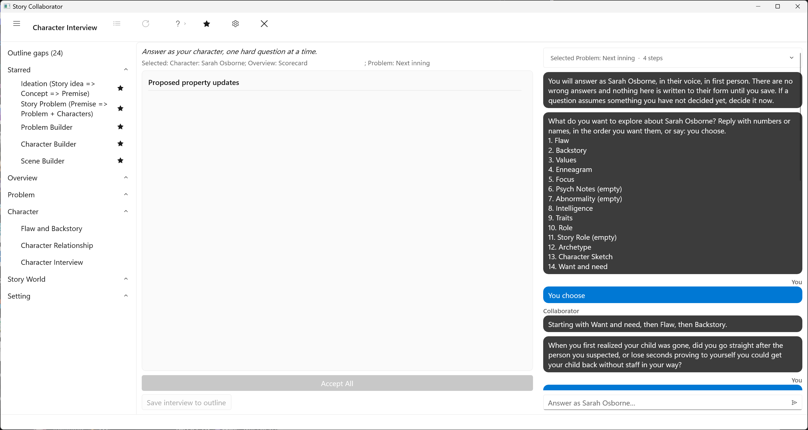
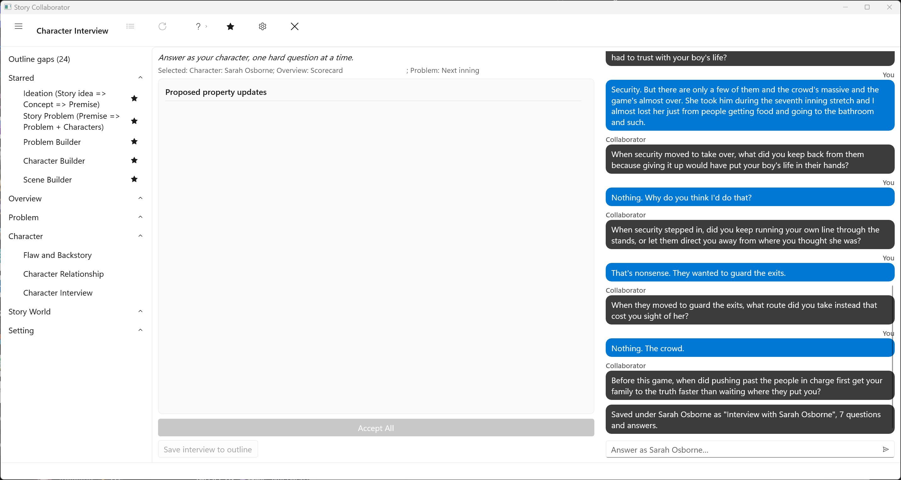

# Character Workflows

These workflows work on one Character at a time, and each opens a picker so you can say which. [Defining Characters](../../Writing%20with%20StoryCAD/Defining_Characters.html) is the craft behind them, and the [Character Form](../../Story%20Elements/Character_Form.html) pages describe the tabs they write. They divide the work: Character Builder fills who the person is in the world and what they are for in the plot, Flaw and Backstory writes the wound and its history, Character Relationship drafts how two people stand with each other, and Character Interview asks you questions in the character's voice instead of filling the form.

## Character Builder

The Character form has two kinds of fields. Some describe the person in the world: Role for occupation, age, and sex; Physical and Appearance for how they look; Social for background; Psychological for how they think; and Inner Traits and Outer Traits for temperament and habit. Others describe the character's place in the plot: Story Role, Archetype, and the Character Sketch. The [Role Tab](../../Story%20Elements/Role_Tab.html) page covers both the occupation Role and the Story Role, which says how much of the story rests on the character (Major, Supporting, Minor, or Service), and the Archetype, which names the pattern they play out: Hero, Mentor, Threshold Guardian, and the rest of Joseph Campbell's list.

Character Builder fills both kinds in one pass, so the sheet and the plot function stay consistent with each other and with any Problem where the character is protagonist or antagonist. The Character Sketch comes last: a short description of why this character is the one who must act, can act, and pays for it, drawn from their motivation, capability and flaw, theme, and stakes. It is not a physical description. Character Builder does not set the Flaw or the Backstory; Flaw and Backstory handles those. It is one of the five workflows starred when you first open Collaborator, and it is a sensible first workflow to run on any new character.

Pick the Character. The run proposes the occupation Role, Age, and Sex; the Social fields; Eyes, Hair, Build, Complexion, and the Appearance note; the Psychological fields; the Inner Traits and a list of Outer Traits; then Story Role, Archetype, and the Character Sketch. That is a long Property Updates list, and Review Each is the comfortable way through it.

## Flaw and Backstory

The [Flaw Tab](../../Story%20Elements/Flaw_Tab.html) page calls a major flaw the root of a character arc: the thing that must be corrected, or will bring the character down. The [Backstory Tab](../../Story%20Elements/Backstory_Tab.html) page describes backstory as the history that explains a character's traits and motives, and warns against shoehorning explanations into it. The two belong together, since a flaw without a history is only a label, and this workflow writes them as a pair.

Pick the Character. If both fields are empty, the run proposes a flaw and a focused history that grounds it. If you have already written either, it keeps your facts and weaves the wound into them rather than replacing them; a filled field shows as Has your text and waits for your review. The Problems the character is linked to set the stakes, and where one of them is Person vs. Himself the run leans on it. Inner and Outer Problems can also write the Flaw from the problem side. Flaw and Backstory will propose a new Flaw even when one is already there; Accept All replaces it. The last accept wins. If you want to keep the Flaw you have and only take the Backstory, use **Review Each** and skip the Flaw row. This workflow does not touch the Story Role, the Character Sketch, the sheet fields Character Builder writes, or Relationships.

On Irene Campbell, the kidnapper in Scorecard, the first run wrote two rows. Backstory is a stadium job history. Flaw is a chase tactic: she overcorrects her route and loses clean positioning. That is not a major flaw, and neither row says she takes a child.

Judge the Flaw row against the Flaw Tab page before you accept. If it is a tactic or a plot beat, leave the list as it is and use the proposal chat. [Reviewing Suggestions](../Reviewing_Suggestions.html) covers how the chat edits waiting rows. Ask for a major character flaw, the wound or blind spot that can bring this person down, and a backstory that is the history of that wound, in this story.

On Irene, that chat was:

Rewrite Flaw as Irene’s major character flaw: the wound or blind spot that makes her take the child and that can bring her down. Rewrite Backstory as the history of that wound. Keep her a kidnapper in this story. Do not describe stadium crowd-control tactics.

The list updates in place. Flaw is the blind spot that makes her take the child. Backstory is the history of that wound.

## Character Relationship

The [Relationships Tab](../../Story%20Elements/Relationships_Tab.html) page describes a relationship as a dynamic between two people, distinct from either of them as an individual, and notes that the two sides of it seldom match. This workflow drafts that dynamic. It asks for two characters in turn, the Character and the Partner, and it works best when each has some sheet fill from Character Builder or Flaw and Backstory, though it runs on thin sheets too. It uses the traits you have filled and does not invent the ones you have not.

Accepting writes a relationship entry on both characters' Relationships tabs: the relationship type, the field the tab labels "is a," together with a Trait, an Attitude, and Notes. The Relationships Tab page explains each of those fields and how to edit the entry afterward. The two sides of a relationship seldom match. If the Notes on both people are the same paragraph, or the type is wrong for the story (Protector on a kidnapper), that is a template problem, not something to paper over in the chat for a first pass. Edit the entries in StoryCAD after you accept.

On Sarah Osborne and Irene Campbell, the run typed Irene as Protector and wrote chase notes: Sarah treats Irene like a barrier, not an ally.

## Character Interview

The other character workflows fill the form. Character Interview does not. It asks you the questions the form cannot: what the flaw once protected, what the character will not trade away, what they refuse to hear. You answer in the first person, as the character. Collaborator never speaks as the character, and it does not write to Role, Story Role, or the Character Sketch. The record is the conversation itself.

Pick the Character. Collaborator then asks what to explore, offering the Character form's labels plus Want and need, or you can let it choose from the form and the character's Problems. Each turn is one question. You decide when it is over. It may keep asking about the same field, often Flaw. Click **Save interview to outline** when you have enough. That button writes the transcript. Saving the outline in StoryCAD does not. The questions and your answers are stored as a note under that character, and a later interview on the same character updates that note rather than adding a second one. The Property Updates list stays empty, because there are no field proposals to accept. There is no Accept All.

