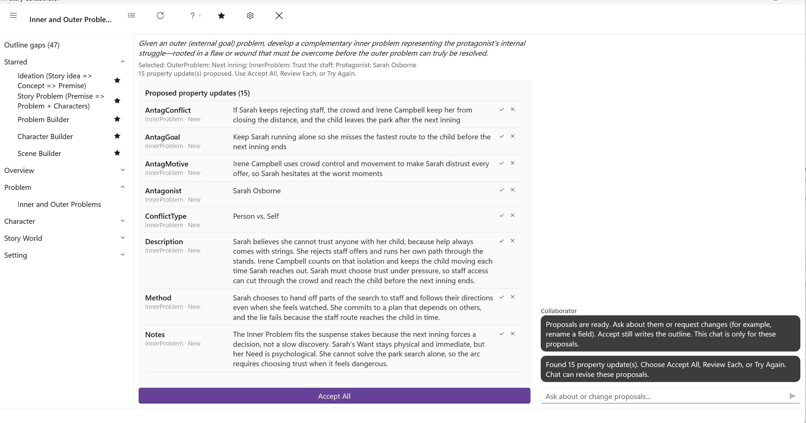
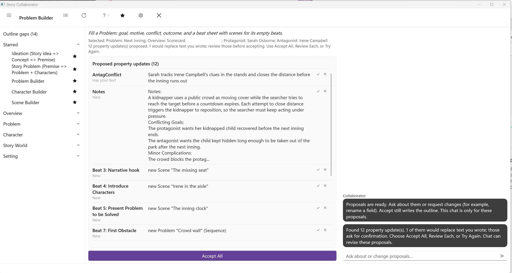

# Problem Workflows

These two workflows work on a Problem element, and each opens a picker so you can say which one. The craft behind them is in [Defining Problems](../../Writing%20with%20StoryCAD/Defining_Problems.html) and [Problem and Character Development](../../Writing%20with%20StoryCAD/Problem_and_Character_Development.html), and the fields they write are described tab by tab starting at the [Problem Form](../../Story%20Elements/Problem_Form.html) page.

## Inner and Outer Problems

Defining Problems distinguishes the outer problem, the external goal the protagonist pursues, from the inner problem, the flaw or wound that must change before the outer problem can truly be resolved. Writers sometimes call these the Want and the Need. StoryCAD keeps them as two Problem elements, and this workflow builds the second from the first.

When you click it, the picker asks for the outer Problem, which must already exist, then for the inner Problem, which you can create on the spot, and then for the protagonist, preselected from the outer Problem's Protagonist tab. If that character already has a Flaw or a Backstory, the workflow uses them as the source of the inner struggle. If not, it proposes a flaw that would explain it.

It writes the inner Problem's form: the Story Question and Problem Type on the Problem tab, the Goal, Motivation, and Conflict on both the Protagonist and Antagonist tabs, and on the Resolution tab the Method and Theme, with its reasoning in Notes. The Conflict Type is set to Person vs. Himself, and the protagonist and the antagonist of the inner Problem are the same character, because that is what an inner problem is. It also proposes a Flaw on that character's Flaw tab. Flaw and Backstory can write the same field from the character's side; whichever you accept last is what stays.

## Problem Builder

A Problem that is ready to use has a goal, a motive, and a conflict on each side, an outcome, and a shape: the beat sheet on its Structure tab that says how its events unfold. Defining Problems covers the first part, and [Plotting with StoryCAD](../../Writing%20with%20StoryCAD/Plotting_with_StoryCAD.html) and the [Structure Tab](../../Story%20Elements/Structure_Tab.html) page cover the second. Problem Builder does both in one pass over a Problem you select.

Before you run it, set three things on the Problem by hand: the Problem Category, and the Protagonist and Antagonist on their tabs. Problem Builder reads all three, and a blank category stops the run before it starts. The picker asks for the Problem; the two characters come from its tabs. If you built the problem with Story Problem (Premise => Problem + Characters), all three are already in place.

The run proposes the Problem tab fields (Name, Problem Type, Conflict Type, Subject, Story Question, and Source of Conflict), the Goal, Motivation, and Conflict for both characters, and the Resolution tab (Premise, Outcome, Method, and Theme), with a situation sheet in Notes. Then it turns to structure. It chooses a beat sheet that fits the Problem Category and Conflict Type, or keeps the one you already chose. For each empty beat it looks first at the scenes and problems in your outline that sit on no beat sheet yet, and binds one there where it fits; for the beats still empty, it creates a new Scene as a stub, with a Scene Type and a cast drawn from your characters. The beat sheet appears in the review as its own rows, one per beat, so you can accept or skip each assignment on its own.

Two rules protect your work. Problem Builder never changes a beat you have already filled, and it never adds beats to a sheet you already chose. The Scene stubs it creates are the only new elements; everything else is a proposal on an existing form until you accept it. It is one of the five starred by default.

