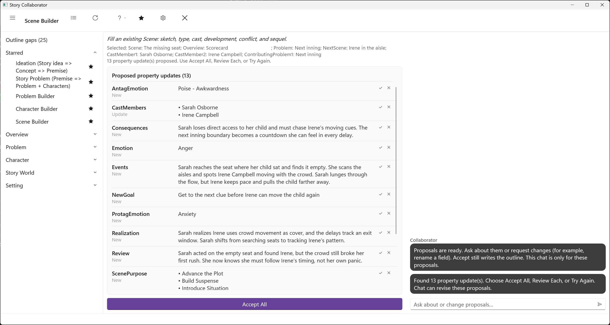

# Scene Workflows

One workflow works on scenes. It fills a scene you have already made; it does not make scenes for you. Problem Builder does that, as stubs on the empty beats of a beat sheet, and this is the workflow that fills them in.

## Scene Builder

[Defining Scenes](../../Writing%20with%20StoryCAD/Defining_Scenes.html) describes a scene as a small story with the same parts as the whole: a goal, opposition to it, and an outcome, followed by the sequel in which the character reacts to what happened and forms a new goal. The [Scene Form](../../Story%20Elements/Scene_Form.html) spreads those parts across its Scene, Development, Conflict, and Sequel tabs, and [Plotting in Scenes](../../Writing%20with%20StoryCAD/Plotting_in_Scenes.html) explains how the scenes join up into a plot.

Scene Builder does not create a Scene. Make the scene first, at least a name and a bit of Scene Sketch, in StoryCAD or as a stub from Problem Builder, then pick it here. It also works on a scene that sits on the story problem, the spine of the outline. When you pick a scene, the run reads the problem whose beat that scene sits on, so a scene assigned to a beat gets better suggestions than one floating free, and it proposes what it can infer. On the Scene tab: the Scene Sketch, the Viewpoint character, the Setting, the Scene Type, the Cast, and the Date and Time. On the Development tab: the Purpose of Scene and the questions that follow it, what value changes hands, what happens, what follows from it, why it matters, and what the character realizes. On the Conflict tab: the Protagonist and Antagonist, their Goals, the Opposition, the Outcome, and what each of them feels. On the Sequel tab: the Emotional Response, the Review and Thought, and the New Goal. Anything else goes in Notes.

The characters in your outline determine your choices for the Cast, the Viewpoint character, and the two roles on the Conflict tab; Like Character Builder, this is a long list of proposals, and Review Each is the comfortable way through it. It is one of the five starred by default.

