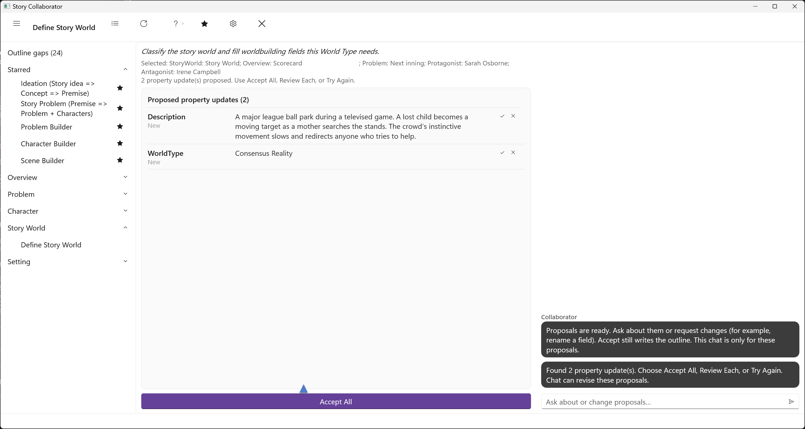
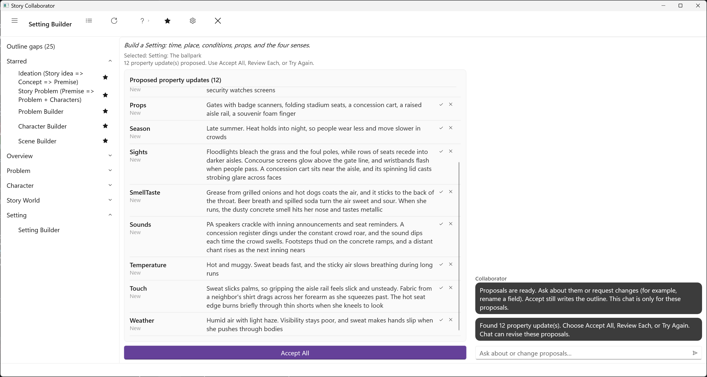

# World and Setting Workflows

Two workflows work on where the story happens. Define Story World works on the single StoryWorld element, the worldbuilding form for the story as a whole. Setting Builder works on one Setting at a time, the specific place and time of a scene.

## Define Story World

The [StoryWorld Form](../../Story%20Elements/StoryWorld_Form.html) is optional, and there is at most one per story, as with the Overview. You add it when the story benefits from organized worldbuilding, and its nine tabs cover structure, physical worlds, species, cultures, governments, religions, history, economy, and magic or technology. Not every story needs all of them, and which ones matter depends on what kind of world it is. The [Worldbuilding Guide](../../Writing%20with%20StoryCAD/Worldbuilding_Guide.html) walks through those choices.

Define Story World starts from that question. If your outline has no StoryWorld, the picker offers to create one. The run proposes a World Type on the Structure tab, a short description of the world, and a list of Cultures, and then fills only the areas that World Type makes live: the Physical Worlds list, the History tab (Founding Events, Major Conflicts, Eras, Technological Shifts, and Lost Knowledge), and the Magic/Technology tab (System Type, Source, Rules, Limitations, Cost, Practitioners, and Social Impact). A few classification fields on the Structure tab follow from the World Type automatically when you accept. It does not fill Settings, Species, Governments, Religions, or Economy; those tabs are yours.

## Setting Builder

[The Importance of Setting](../../Writing%20with%20StoryCAD/The_Importance_of_Setting.html) makes the case that setting is more than backdrop: it shapes mood, creates obstacles, and reflects theme. The Setting form has a [Setting Tab](../../Story%20Elements/Setting_Tab.html) for time, place, and conditions and a [Sensations Tab](../../Story%20Elements/Sensations_Tab.html) for what the place does to the senses. Setting Builder fills both in one pass, in that order, so that when it writes the sights and sounds it already knows the season, the light, and the weather it has just proposed.

Pick the Setting. The run proposes the Setting tab fields, Period, Locale, Season, Weather, Lighting, and Temperature, and the Props: the objects in the place that a character can pick up, fiddle with, break, or stare at. Then it works through the Sensations tab, Sights, Sounds, Touch, and Smell/Taste, with anything left over in Notes. Locale and Season are suggestion lists in StoryCAD rather than fixed choices, and the proposals treat them that way. Smell gets particular attention, for the reason the Sensations Tab page gives: it is the primitive sense, and it pulls a reader in.

