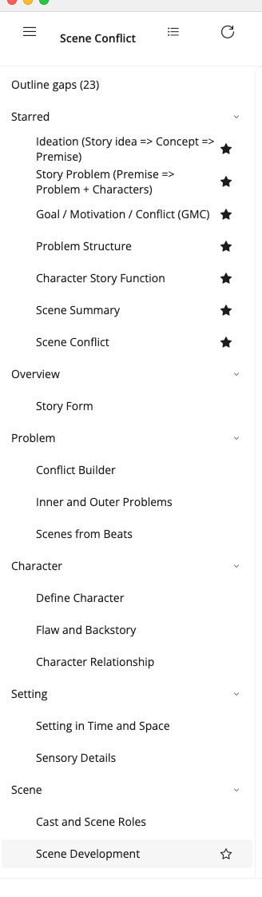

# Workflows and Writing Craft

## What is a workflow?

A **workflow** is a short, focused craft job.

You pick one workflow from Collaborator’s list (for example, “turn my idea into a premise”). Collaborator looks at the parts of your outline that workflow needs, then suggests text for specific fields on those story elements. You review the suggestions and accept only what you want.

One workflow, one craft question. That keeps the work small enough to judge.

## Craft questions map to workflows

StoryCAD’s manual already teaches the craft spine: idea and premise, problems, characters, structure, scenes. Collaborator’s workflows line up with those same questions.

| Craft question | Learn more in StoryCAD | Typical Collaborator workflow(s) |
|----------------|------------------------|----------------------------------|
| What’s my idea, concept, or premise? | [Story Idea, Concept, and Premise](../Writing%20with%20StoryCAD/Story_Idea_Concept_and_Premise.html) | Premise; Story Form (genre and story type) |
| What’s the main story problem? | [Defining Problems](../Writing%20with%20StoryCAD/Defining_Problems.html), [Problem and Character Development](../Writing%20with%20StoryCAD/Problem_and_Character_Development.html) | Story Problem; Goal / Motivation / Conflict (GMC) |
| Outer want vs inner need? | [Defining Problems](../Writing%20with%20StoryCAD/Defining_Problems.html) (outer and inner problems) | Inner and Outer Problems |
| How is the story shaped? | [Plotting with StoryCAD](../Writing%20with%20StoryCAD/Plotting_with_StoryCAD.html), Overview Structure | Problem Structure |
| Who is this character? | [Defining Characters](../Writing%20with%20StoryCAD/Defining_Characters.html) | Character Story Function; Flaw and Backstory; Define Character |
| What happens in this scene? | [Defining Scenes](../Writing%20with%20StoryCAD/Defining_Scenes.html), [Plotting in Scenes](../Writing%20with%20StoryCAD/Plotting_in_Scenes.html) | Scene Summary; Scene Conflict |

Names on the list may be slightly longer in the app (for example, a full “Ideation…” label). The work is the same: one craft focus per run.

## Same spine teachers already use

A useful order for learning fiction structure is roughly:

**Idea → Premise → Story Problem → GMC → Characters → Structure → Scenes**

That is also a sensible order for Collaborator. You do not have to follow it, but jumping straight to scene work with an empty Overview usually produces thin results. Craft first, then tool.

For broader craft reading beyond this manual, see [StoryBuilder Resources](https://storybuilder.org/resources/) and [Learn](https://storybuilder.org/learn/).

## Workflows and story elements

StoryCAD stores your outline as forms and tabs. Collaborator suggests text for **fields on those forms** (Premise on Overview, Goal on a Problem, Flaw on a Character, and so on). After you accept a suggestion, open the same element in StoryCAD and you should see the text there.

If a field is empty, a suggestion is easy to try. If the field already has *your* words, Collaborator will not bulk-overwrite them without a deliberate review. See [Reviewing Suggestions](Reviewing_Suggestions.html).
