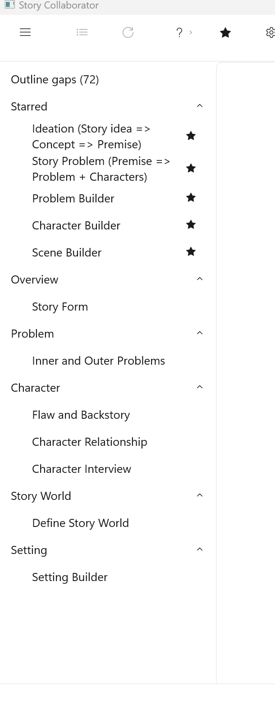

# Workflows and Writing Craft

## What a workflow is

Collaborator divides the work of developing an outline into workflows, in the same sense the [Workflow](../Writing%20with%20StoryCAD/Workflow.html) page of this manual uses the word: a larger job broken into steps, each small enough to do and to judge on its own. A Collaborator workflow is one such step. You choose it from the list, Collaborator reads the story elements that step needs, and it proposes text for particular fields on those elements. The workflow offers you something concrete to respond to, and you decide whether to keep, reject, or modify Collaborator's suggestions. 

A StoryCAD story element is a collection of properties, and Collaborator makes suggestions for the properties most important to developing your story, using related properties and linked story elements, but also maintaining some context on your entire outline.  

Keeping each workflow step to one craft question is deliberate. A suggestion for one Problem's goal and motivation can be weighed against what you know of the story; a suggestion that rewrote half the outline at once could not be. The [Workflow Reference](Workflows/) describes each workflow in turn.

## The part and the whole

An outline in StoryCAD is a whole made of parts. The parts are story elements: the Overview, Problems, Characters, Settings, and Scenes, and each of them is a form with its own properties: a Problem has a goal and a conflict, a Setting has a season and a smell. The Workflow page refers to story elements as the building blocks of fiction and organizes the craft chapters of this manual around them, dedicating one chapter to problems, another to characters, another to scenes, and another to setting. Almost everything writers have conveyed about craft revolves around a part.

Outlining moves back and forth between two kinds of work. One kind requires the writer to analyze the story by breaking it down so that each element can be examined individually, questioning whether this character's motive is valid or whether this scene achieves its purpose. The other is synthesis: putting the parts back together and asking whether they make one story. Neither works alone. You often can't improve the whole outline at once, because it's too large to hold in mind at once. You can improve each part more easily, and afterwards, fit the parts together again.

Collaborator works on the analysis side of that exchange. A workflow takes one element, or a small related set such as a Problem with its protagonist and antagonist, or a Scene with its setting and cast, and proposes values for that part's properties. It reads the rest of the outline for context, your premise, how far the outline has come, what is still empty, but it writes only to the part in front of it. That is why its suggestions can be judged. You can tell whether a proposed goal fits the character you know, or whether the props it suggests would serve the scene you have in mind, in a way you could never judge a rewrite of the whole story at once. And the whole improves as the parts do. When a Problem's goal and conflict are sharp, the scenes that carry it have something to be about, and the premise you condense from it reads truer.

The synthesis stays with you. Deciding what to accept is part of it, and so is the structure that joins the parts: the Story Problem on the Overview, the protagonist and antagonist on a Problem, the beat sheet that puts scenes in order. Problem Builder is the one workflow that reaches across parts, binding scenes to the beats of a Problem, and even it works one Problem at a time. The chapters of Writing with StoryCAD teach the parts; the [Workflow Reference](Workflows/) shows which workflow works on each; and the whole, as it always was, is the writer's.

## Craft questions and the workflows that answer them

The Writing with StoryCAD section of this manual teaches outlining as a sequence: idea and premise, then the story problem, then the characters who carry it, then structure, then scenes. Collaborator's workflows follow the same sequence, and each one has a page in that section that explains the craft behind it.

| Craft question | Read first | Workflow |
|----------------|------------|----------|
| What is my idea, concept, or premise? | [Story Idea, Concept, and Premise](../Writing%20with%20StoryCAD/Story_Idea_Concept_and_Premise.html) | Ideation (Story idea => Concept => Premise); Story Form for genre and story type |
| What is the main story problem? | [Defining Problems](../Writing%20with%20StoryCAD/Defining_Problems.html), [Problem and Character Development](../Writing%20with%20StoryCAD/Problem_and_Character_Development.html) | Story Problem (Premise => Problem + Characters); Problem Builder |
| What does my protagonist want, and what do they need? | [Defining Problems](../Writing%20with%20StoryCAD/Defining_Problems.html) | Inner and Outer Problems |
| How is the story shaped? | [Plotting with StoryCAD](../Writing%20with%20StoryCAD/Plotting_with_StoryCAD.html), [Structure Tab](../Story%20Elements/Structure_Tab.html) | Problem Builder, which chooses the beat sheet |
| Who is this character, and what are they for? | [Defining Characters](../Writing%20with%20StoryCAD/Defining_Characters.html) | Character Builder; Flaw and Backstory; Character Relationship; Character Interview |
| Where and when does it happen? | [The Importance of Setting](../Writing%20with%20StoryCAD/The_Importance_of_Setting.html), [Worldbuilding Guide](../Writing%20with%20StoryCAD/Worldbuilding_Guide.html) | Setting Builder; Define Story World |
| What happens in this scene? | [Defining Scenes](../Writing%20with%20StoryCAD/Defining_Scenes.html), [Plotting in Scenes](../Writing%20with%20StoryCAD/Plotting_in_Scenes.html) | Scene Builder |

## The order teachers use

Writing classes usually teach story structure in roughly this order: idea, premise, story problem, then the goal, motivation, and conflict on each side of that problem, then characters, structure, and scenes. Collaborator walks the same order with fewer stops, because Problem Builder does the goal-motivation-conflict work and the structure work in one run, and Scene Builder does the scene work. You are free to run any workflow at any time. Running Scene Builder on an outline with an empty Overview will work, but the suggestions will be thin, because there is little for them to draw on; the craft has to come first, and then the tool has something to help with. [A Path to Try](Tutorial/A_Path_to_Try.html) sets out an order that wastes the least time.

For craft reading beyond this manual, see [StoryBuilder Resources](https://storybuilder.org/resources/) and [Learn](https://storybuilder.org/learn/).

## Workflows write to the forms you already use

StoryCAD stores your outline as forms with tabs and fields, and Collaborator suggests text for those same fields: the Premise on the Overview, a Goal on a Problem's Protagonist tab, the Flaw on a Character. When you accept a suggestion, open the same element in StoryCAD and the text is there, where you can edit it like anything else you typed.

An empty field is easy to try a suggestion on. A field that already holds your words is treated differently: Collaborator marks it Has your text and will not overwrite it without asking you first. [Reviewing Suggestions](Reviewing_Suggestions.html) explains the marks, and what **Accept All** does with each one.
