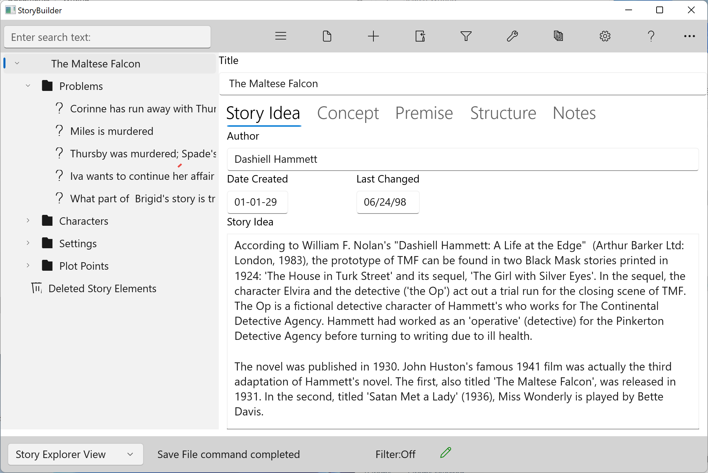

### Story Elements ###
Story Elements  

Your outline is a tree of Story Elements which are displayed in the Navigation Pane. Clicking (or touching) a Story Element node on the Navigation Pane will display that Story Element’s  content in the Content Pane.  
Here, clicking on the first or root node in the tree displays the Story  Overview  Form.   

On some screen sizes and orientations the Navigation and Content panes may be stacked with the Navigation pane above the Content pane. In those cases the Show/Hide Navigation button (the hamburger menu button) acts differently; it toggles from the Navigation Pane to the Content Pane and back.  

Every Story Element type is a different form. These are the story elements:  

	•	Story Overview   
	•	Problem  
	•	Character  
	•	Setting  
	•	Scene  
	•	Folder  
	•	Section  

Your outline has only one Story Overview; it’s created automatically when you open or create a new outline. The Story Overview is the root of the Navigation Pane tree, and all other Story Elements are below it.   

Every form also has a full-page tab (labeled Notes) which holds your general notes and thoughts regarding the story element. We won’t talk about these again; just be aware that they’re there.  

