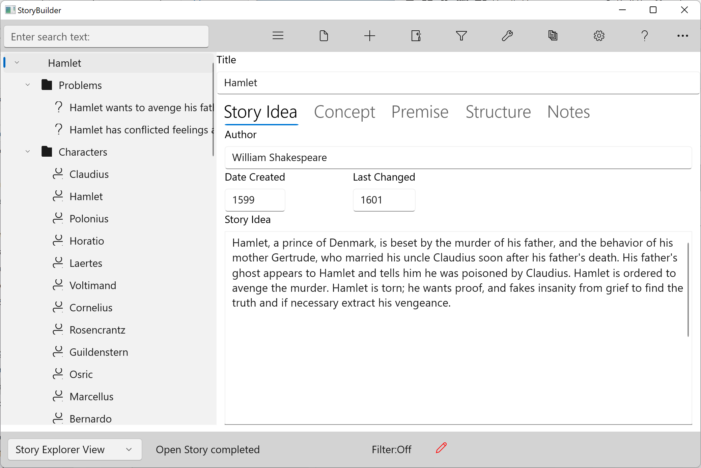

### Story Idea Tab ###
Story Idea Tab  

Not every story idea will become a story you want to write, but the habit of being on the lookout for and recording story ideas is useful.  Recording that initial idea here.  

Fields:  

Title&nbsp;&nbsp;&nbsp;&nbsp;&nbsp;&nbsp;&nbsp;&nbsp;&nbsp;&nbsp;&nbsp;&nbsp;     &nbsp;&nbsp;&nbsp;&nbsp;&nbsp;&nbsp;&nbsp;&nbsp;Every story element has a Name field. By convention the name of the Story Overview is the working title of your story. You can change the Title any time. We recommend that you make your StoryCAD project the same as your title.   

Author&nbsp;&nbsp;&nbsp;&nbsp;&nbsp;&nbsp;&nbsp;&nbsp;&nbsp;&nbsp;&nbsp;&nbsp;&nbsp;&nbsp;&nbsp;&nbsp;&nbsp;&nbsp;&nbsp;&nbsp;The creator of the story. This defaults to your User Name in Preferences.  

Date Created&nbsp;&nbsp;&nbsp;&nbsp;&nbsp;&nbsp;&nbsp;&nbsp;&nbsp;&nbsp;&nbsp;&nbsp;The date the outline was first created.  This field is automatically filled when you create the project.&nbsp;&nbsp;&nbsp;&nbsp;&nbsp;&nbsp;&nbsp;&nbsp;  

Last Changed&nbsp;&nbsp;&nbsp;&nbsp;&nbsp;&nbsp;&nbsp;&nbsp;&nbsp;&nbsp;&nbsp;&nbsp;The date the outline was last modified. This field is automatically modified whenever you modify the outline and save your work.  
&nbsp;&nbsp;&nbsp;&nbsp;  
Story Idea&nbsp;&nbsp;&nbsp;&nbsp;&nbsp;&nbsp;&nbsp;&nbsp;&nbsp;&nbsp;&nbsp;&nbsp;&nbsp;&nbsp;&nbsp;&nbsp;This is the place to record the original idea that led you to want to write this story.&nbsp;&nbsp;&nbsp;&nbsp;  

   
[Previous - Story Overview Form](Story_Overview_Form.md)   
[Next up - Concept Tab](Concept_Tab.md)
