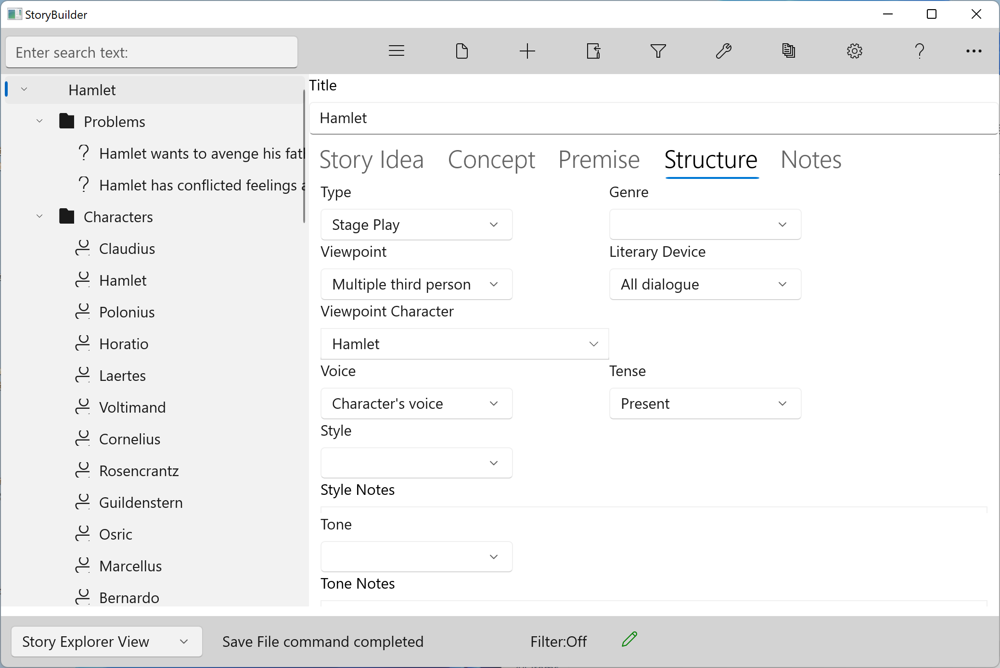

### Structure Tab ###
Structure Tab  

Structure is the order and manner in which you tell your story. Structure has two meanings. This tab is concerned with the constraints you put on the story (hopefully early in your story development.) The second meaning is concerned with the order and arrangement of story elements; you’ll create this as you develop your outline.   

Fields:  

Type			     			The dramatic form in which you plan to tell your story. Each type roughly determines length, and has its own set of conventions and restrictions.  

Genre						Each genre is a category characterized by its own style, form, and content, but more importantly, reader expectations.  

Viewpoint				The person(s) and perspective from which the story is told. We recommend paying particular attention to viewpoint before  		  

Viewpoint Character	For First Person and Limited Third Person viewpoints, the specific character.  		  

Literary device			Literary devices are structural devices or gimmicks you can use to add meaning or tone. The proper literary device(s) can amplify your story’s message, but use caution.  
	  
Voice						The speech and thought patterns of the character(s) in the story. Beyond these forms of narration, a character’s voice is defined in his dialog.  

Tense						Tense indicates when events or actions occurred in time---in the past, present, or future. Your verb choices can also indicate aspect (completeness or effect).  

Style						Style is the way you use language, based on word choice, tone, syntax, and use of literary devices. Particular style are chosen depending on the desired effect.  

Tone						Tone indicates the mood or impression you wish the reader to feel.  
