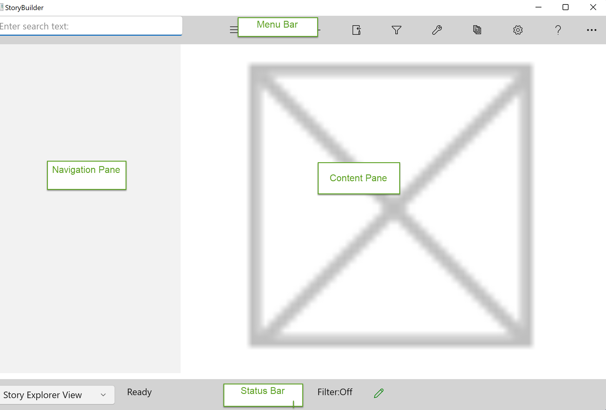

## The StoryCAD User Interface ##
The StoryCAD User Interface  

The form’s sections are as follows. They’ll be explained in more detail as we go.  

	•	Menu Bar -  Access to common tasks  
	•	Status Bar - Displays program status information  
	•	Navigation Pane - A tree of Story Elements  
	•	Content Pane - The contents of the currently selected Story Element  

[Menu Bar](Menu_Bar.md)   
[Navigation and  Content Panes](Navigation_and_Content_Panes.md)   
[Status Bar](Status_Bar.md)   
