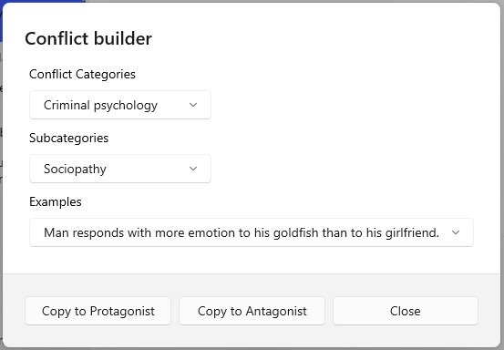

## Conflict Builder

The Conflict Builder is a dialog invoked by the **Conflict** button on the Protagonist and Antagonist tabs of the Problem form. It helps you find and name the specific conflict driving your story's central problem.

### What the taxonomy is

The Conflict Builder's categories come from two sources. The core five (Relationship, Information, Interest, Structural, and Value) are drawn from the five-category conflict framework that conflict resolution practitioners use to classify disputes by root cause rather than surface behavior. Criminal Activities and Criminal Psychology were added as a fiction-specific extension, because crime drives a large portion of plotted fiction and doesn't fit cleanly into the original five categories.

### How to use it

Open the Conflict Builder from either the Protagonist or Antagonist tab of the Problem form. Choose a category that describes the type of friction between your characters. Then pick a subcategory and select or adapt an example that fits your story.

The example you choose populates the Protagonist Conflict or Antagonist Conflict field on the Problem form. These fields describe the specific clash each party faces — not the overall problem, but the particular pressure point that makes the conflict personal to that character.

A protagonist facing a land dispute (Interest > Ownership) and an antagonist who views the same dispute as a matter of family honor (Value > Family) are in the same story but in different conflicts. The Conflict Builder lets you name both.

### Categories

**Relationship**
Relationship conflicts arise from negative behavior patterns, strong emotions, poor communication, or pressure from third parties. They tend to follow a downward spiral of destructive actions.

**Information**
Information conflicts arise when people lack data to make good decisions, are deliberately or accidentally misinformed, or disagree about how to interpret the same data.

**Interest**
Interest conflicts are driven by competition over needs each party believes are incompatible. Often expressed as power struggles. Subcategories cover substantive issues (money, resources), procedural issues (how a dispute is resolved), and psychological issues (fairness, respect, trust).

**Structural**
Structural conflicts are imposed by external forces: limited resources, geographic constraints, organizational changes, time pressure. The conflict isn't between the people so much as between the people and their circumstances.

**Value**
Value conflicts arise from incompatible belief systems. They're the most resistant to resolution because they aren't about facts or resources — they're about what each party believes is right.

**Criminal Activities**
This extension category covers conflicts driven by criminal behavior, organized by crime type. Useful for crime fiction, thrillers, and any story where a law is broken.

**Criminal Psychology**
This extension category approaches crime from the offender's psychology rather than the act itself. Useful for character-driven stories where the antagonist's inner life matters as much as what they do.
