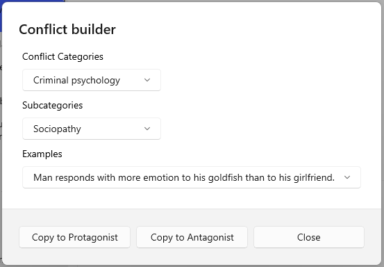

## Conflict Builder

The Conflict Builder is a dialog on the Protagonist and Antagonist tabs of the Problem form. It classifies conflicts with two properties, **Category** and **SubCategory**, plus an **Example** list. Choose an example and copy it into the Protagonist Conflict or Antagonist Conflict field.

While we often think we'd like to live our lives with a minimum of conflict, we're fascinated by the stuff, and our fiction absolutely depends on it.

Conflict is easy to define: it's what prevents your character from achieving his or her goal. Picking the right conflict is arguably the most important decision you'll make in designing your story. If there's no struggle, there's no story. Robert McKee puts it this way: Nothing moves forward in a story except through conflict.

Not all conflict will suit your needs. It's easy to swing towards either of two directions. At the one extreme is senseless violence, with Black Bart villains and a need for your hero to wear tights and a cape. At the other lies the absence of meaningful conflict, replaced with shallow conflicts which are easily resolved and lead to Pollyanna outcomes. The right conflict adds complexity and layers of meaning to your story.

There are endless forms of conflict, but there is a literature and practice that applies some order to it all: Conflict Resolution Theory. CR Theory comes from third-party work on conflict resolution as practiced by mediators and legal authorities. Those efforts try to find peaceful resolutions to disputes. That is emphatically not your aim as a fiction writer. You want to build conflict. CR Theory still gives you a useful framework to examine it.

### How to use it

Open Conflict Builder from either tab. The dialog lists Categories alphabetically. Pick a **Category**, then a **SubCategory**, then an **Example**. **Copy to Protagonist** or **Copy to Antagonist** writes that example into the matching Conflict field on the Problem form.

Those fields are not the overall problem. They are the pressure point that makes the clash personal to that character. A protagonist in a land dispute (Interest, Ownership of something) and an antagonist who treats the same dispute as family honor (Value, Family) are in the same story but in different conflicts.

### A classification of all possible conflicts

Category and SubCategory together are a classification of possible conflicts. The classification has two parts, coupled:

1. Conflict Resolution Theory, which groups disputes by root cause: Relationship, Information, Interest, Structural, Value, and Identity.
2. A hierarchy for crime: **Criminal activities** (the behaviour) and **Criminal psychology** (abnormal psychology of the offender).

Each Category has SubCategories. Each SubCategory has examples.

Conflict Resolution Theory has a shortcoming: it is based on work to reduce and resolve conflict. The criminal justice system exists because conflict, past a breaking point, becomes the purview of crime and punishment. The two crime Categories close that gap so the classification covers plotted fiction as well as ordinary disputes.

### Relationship

Relationship conflicts occur because of negative behavior patterns by one or both parties, strong negative emotions, misconceptions and stereotypes, and poor (or no) communication. They frequently involve pressure from other non-relationship issues (such as money) or third parties. Relationship problems often follow a downward spiral of destructive actions.

SubCategories follow the type of relationship: Family, Romantic, Professional, Group, Friends, and Self (inner conflicts).

### Information

Information conflicts occur when people lack the information necessary to make good choices, are accidentally or intentionally misinformed, or disagree on what data is important or how it should be interpreted. They frequently involve poor communication between the adversaries.

SubCategories: Information nobody knows (mystery, problem to solve), Data deliberately kept hidden, Information was wrong, and Disagreement about what the data mean.

### Interest

Interest conflicts are caused by competition over perceived incompatible needs. Conflicts of interest result when one or more of the parties believe that in order to satisfy his or her needs, the needs and interests of an opponent must be sacrificed; that a zero-sum game is being played. Interest-based conflict will commonly be expressed as power struggles and rank pulling.

SubCategories: Ownership of something (money, land, title, etc.), Procedural issues (how to proceed), and Psychological need (fairness, respect, trust, etc.).

### Structural

Structural conflicts are caused by forces external to the people in dispute. Limited physical resources or authority, geographic constraints (distance or proximity), time (too little or too much), organizational changes, and so forth can make structural conflict seem like a crisis. One possible outcome of a structural conflict, rare in fiction, is cooperation or a structural change.

SubCategories: Limited resources (competition over land, food, etc.), Authority, External changes (drought, flood, need to migrate, etc.), and Organizational.

### Value

Value conflicts are caused by perceived or actual incompatible belief systems. Values are beliefs that people use to give meaning to their lives. People frequently couch values in terms of right and wrong. Value disputes arise when people attempt to force one set of values on others or lay claim to exclusive value systems that do not allow for divergent beliefs. Value conflicts are generally intractable.

SubCategories are named for the value at stake (Family, Integrity/Honesty, Freedom/Independence, and many others).

### Identity

Identity conflicts arise when a character's sense of who they are is at odds with the group or society they belong to: personal values against expected norms. They can show as resistance, rebellion, or withdrawal.

SubCategories: Ethnic/racial, Gender identity, Sexual orientation, Religious, and Political.

### Criminal activities

This Category classifies conflict by the criminal act. Use it when the clash is the crime itself.

SubCategories: Crimes of desperation, Crimes of passion, Crimes of opportunity, Organized crime, White-collar crime, Cybercrime, Hate crime, Environmental crime, State-sponsored crime, and Substance-related crime.

Crimes of passion are different from the others. The legal sense is a crime committed in a moment of passion in response to provocation. We all know provocation, and have probably acted in ways we regret in response to it. It's easy to see ourselves committing some of these: stealing in order to feed a starving child, or beating a bully who "deserves it."

### Criminal psychology

This Category approaches crime from the character of the offender rather than the act. The other crime SubCategories under Criminal activities are about what was done. These are about who does it, often as a standing pattern rather than a single outburst.

SubCategories: Antisocial behavior, Narcissism, Sociopathy, and Psychopathy.

These patterns are deliberate and often feel organic, a part of the individual's nature. They can relate to narcissistic personality disorder. Every one of us possesses some basic traits of narcissism (self-focus, lack of empathy, desire for power and control) in some degree.

When you think about conflict in your fiction, consider how a resolvable conflict can devolve into a more serious one. That process is finding complications.
