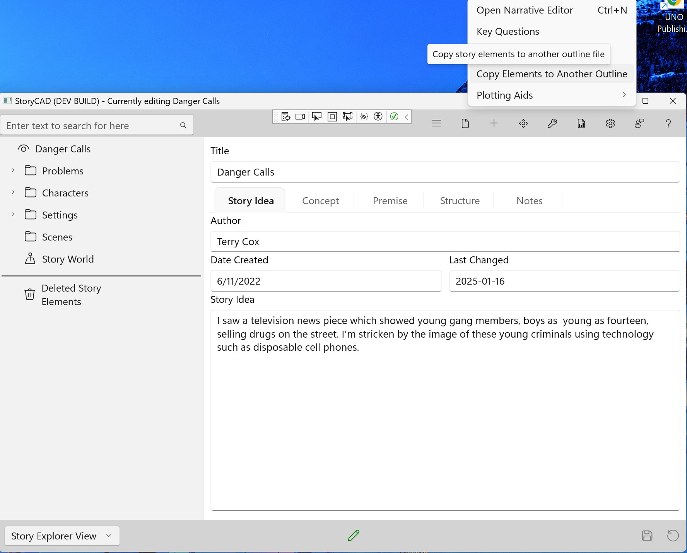
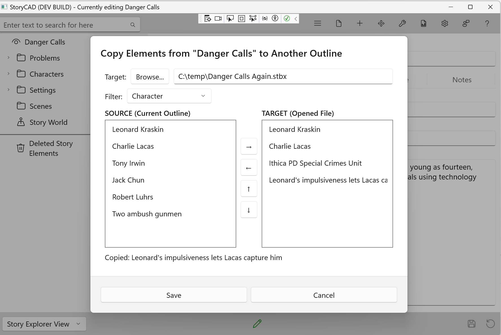
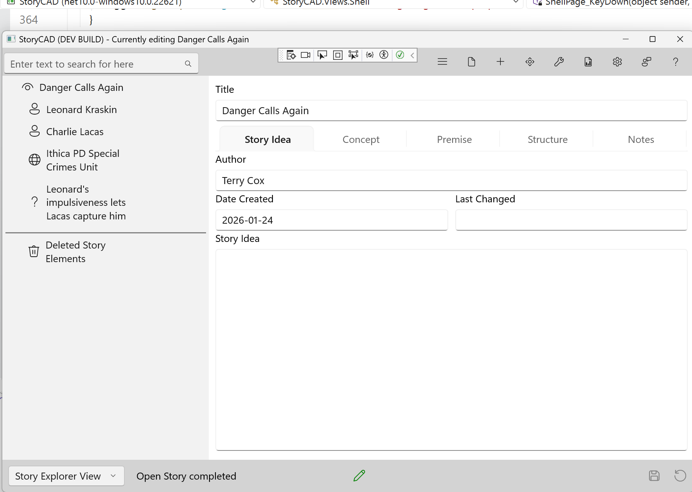

## Copy Elements to Another Outline

The Copy Elements tool lets you copy story elements from your current outline to another outline file. This is useful when you want to reuse characters, settings, or other elements across multiple stories, such as in a series, or when building a library of reusable story elements.

### Opening the Tool

Select **Tools > Copy Elements** from the menu bar.

The Copy Elements dialog will open.

### Selecting a Target File

Before you can copy elements, you need to choose which outline will receive the copied elements.

1. Click the **Browse** button at the top of the dialog.
2. Navigate to and select the outline file (.stbx) you want to copy elements into.
3. The file path will appear in the display area next to the Browse button.

If you change the target file after copying some elements, the list of copied elements will be cleared so you can start fresh with the new target.

### Understanding the Dialog Layout

The dialog has two main areas:

- **Left pane (Source Elements)**: Shows elements from your current outline, filtered by the selected type.
- **Right pane (Target Elements)**: Shows elements you have copied during this session.

Above the panes is a **Filter** dropdown that lets you select which type of element to display in the source list: Character, Setting, Problem, Notes, Web, or StoryWorld.

Between the panes are several buttons:
- **Right arrow**: Copy selected element to the target list
- **Left arrow**: Remove selected element from the target list
- **Up/Down arrows**: Navigate through the source list

### Copying Elements

1. Use the **Filter** dropdown to select the type of element you want to copy (for example, Character).
2. The left pane will show all elements of that type in your current outline.
3. Select an element you want to copy.
4. Click the **right arrow** button to copy it to the target.
5. The copied element will appear in the right pane.

You can change the filter to copy different types of elements. The target list on the right preserves all elements you have copied during this session, regardless of which filter is currently selected.

### Managing Copied Elements

The target list on the right shows all elements you have copied in this session. If you change your mind about an element:

1. Select the element in the target list.
2. Click the **left arrow** button to remove it.

You can only remove elements that you copied during this session. Elements that already existed in the target file cannot be removed through this dialog.

### Saving Your Changes

When you are finished selecting elements to copy:

- Click **Save** to write the copied elements to the target file.
- Click **Cancel** to close the dialog without making any changes.

### Viewing Your Results

After saving, you can open the target outline to see your copied elements. The copied elements appear in the Navigation Pane along with any elements that were already in the outline.

### What You Can Copy

| Element Type | Can Copy | Notes |
|-------------|----------|-------|
| Character | Yes | Copies the full character with all properties |
| Setting | Yes | Copies the full setting with all properties |
| Problem | Yes | Copies story problems and conflicts |
| Notes | Yes | Copies research and notes |
| Web | Yes | Copies web links and references |
| StoryWorld | Yes | Only one StoryWorld is allowed per story |
| Scene | No | Scenes are specific to each story's narrative |
| Folder | No | Folders are organizational only |
| Section | No | Sections are part of narrative structure |

### Tips

**Building a series**: If you are writing a series of stories, you can create a "master" outline containing all your recurring characters and settings. Use Copy Elements to bring these elements into each new story in the series.

**StoryWorld limitation**: Each story can have only one StoryWorld element. If the target outline already has a StoryWorld, you cannot copy another one into it.

**Elements are copies**: When you copy an element to another outline, it becomes an independent copy. Changes you make to the original will not affect the copy, and vice versa.

**Building an element library**: Consider creating a separate outline file as a library of reusable elements. You can collect interesting characters, settings, and problems there, then copy them into new stories as needed.
