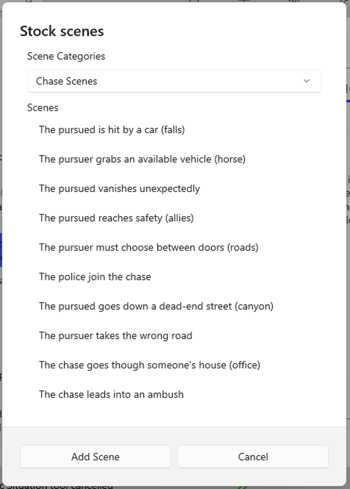

### Stock Scenes

This tool, invoked from the Plotting Aids sub-menu of the Tools menu, provides a list of several categories of stock scenes. These are scenic situations which recur frequently in fiction. 

While your plot and story should be as distinct and original as you can make it, stock scenes can be found throughout literature, and are a valuable part of any writer's tool kit.

Selecting one of the categories will result in the display of a form listing some stock scenes in that category.  Selecting one or more of these scenes, and clicking on the Copy control, will cause a scene to be added to the plot, immediately after the current scene, with the stock scene's title as the scene summary.

Stock Scenes can be tailored to display any sub-menus of stock scenes you wish. You can modify the contents of the existing sub-menus, or add or replace sub-menus.