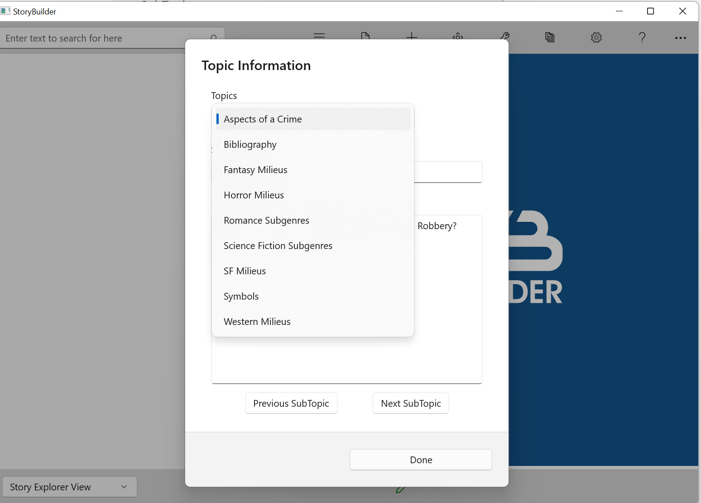

## Topic Information ##
Topic Information  

The Topic Information sub-menu on the Tools menu contains a list containing information specific to certain topic categories:  

A topic, once selected, may contain sub-topics:  

.   

Information on some of the topic categories follows.  
Aspects of a Crime  

When plotting a mystery, it's useful to plot 'backwards' from the crime itself.  Parts of a Crime provides a reminder of aspects of a crime you should take into consideration.  
Milieus  

Each genre contains certain elements which tend to recur as environment, backdrop, settings, and situations.  The Milieu entries contain lists of some of these elements.  
Subgenres  

Contains brief descriptions of some of  the finer classifications of a particular genre.  

