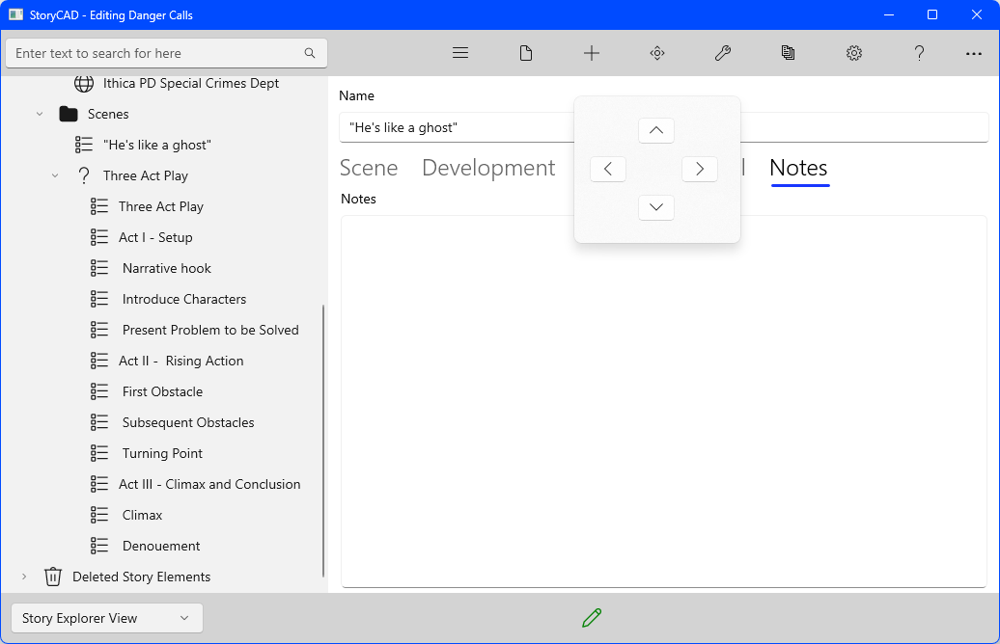
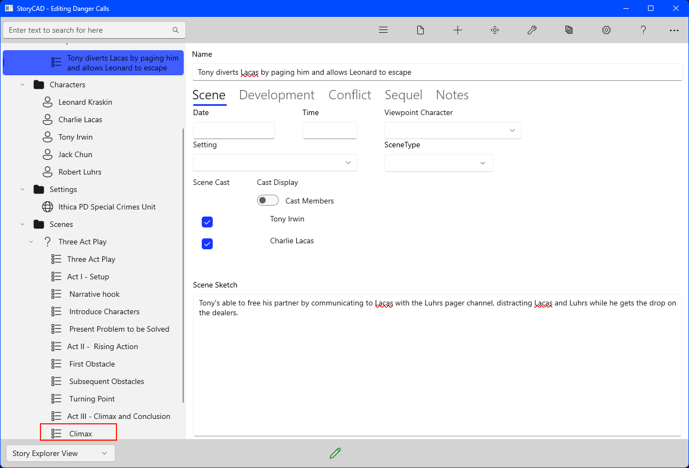

## Creating a Story pt 6
Story structure is the closest you have to a recipe for plotting your story. Your goal, in following a template story structure like the ones the Master Plots tool provides, is to create scenes for your story that fit into the structure you’ve chosen, and to position them accordingly. The scenes you’ll use are what develops from your characters trying to solve their problems.
 
We can replace the plot point for ‘Narrative Hook’ with  ‘He’s like a ghost’, the scene we added earlier. Let’s move our scene where it belongs, treating the MasterPlot scenes as they’re intended, temporary scaffolding. First, right-click on the scene, and then click on the ‘Move’ icon on the menu bar:

Click on the down arrow repeatedly until you’ve positioned it where you wish:

After we've moved our scene to where we want it, we can get rid of the placeholder by right-clicking on the 'Narrative hook' scene and clicking the Move to Trashcan icon. 

The scene will be moved under Deleted Story Elements. At the bottom of the Navigation Pane. If you think deleting a story element is a bad idea, you can move it back by right-clicking on it and clicking on the Restore Story Element from Trashcan button. 

The placeholder scenes added by Master Plots each describe one function, but it’s wrong to think that a real scene only does one thing. The ‘He’s like a ghost’ scene, our Narrative Hook, also Introduces Characters- not all of them, but our protagonists, Leonard Kraskin and Tony Irwin, and, from a remove, our antagonist, Charlie Lacas. It also Presents a Problem to be Solved- ‘How will Leonard and Tony get past Charlie's tech?’, which is in fact a sub-problem of the Story Problem, ‘Catching the drug dealer Lacas’.  To illustrate, here’s a reorder of the Problems.

The two sub-problems have been moved under the main problem, and our one scene so far (‘He’s like a ghost’) has been moved under the problem it’s a part of.  The MasterPlots tool was also used a second time, to copy a slightly different kind of story structure, a pattern of action- the Escape.  Back when we worked on our story idea we already had an idea of what our climax scene  would be; this placeholder represents that. Clicking on this scene, we can make it our own by renaming it to 'Tony diverts Lacas by paging him and allows Leonard to escape’ and using our story Premise description. We also added the scene cast members by selecting their names from New Cast Member drop-down and clicking the ‘+’ Add Cast Member button.

The Three Act Play structure we added under the Scenes folder contains a ‘Climax’ plot point, with Notes that read:

   This is the point in which the story problem is solved, one
way or another. Either the protagonist succeeds in obtaining her
goal, or she fails, or she decides that the goal isn't worth obtaining
any more, or she discovers something that changes the situation- usually
something about herself. It's important that your protagonist takes
her fate in her own hands and solve, or try to solve, her own problem.
Having the calvary ride up at the last minute is no longer acceptable.

Our ‘Escape’ scene under the ‘Leonard’s impulsiveness lets Lacas capture him’ problem is this part of the story’s structure as well. 

Plotting is usually the last thing in story design to worry about, for several reasons.  The characters should be well defined, so that their actions are consistent with their natures.  The story problems should also be clearly understood, especially the resolutions.  Every problem is a story in miniature; plotting a story is largely a matter of arranging events from one or more problems into a satisfactory sequence.  But writing is a process of accumulation, and the ideas which you collect to create your story concept can come to you at any time.  If you visualize a scene.