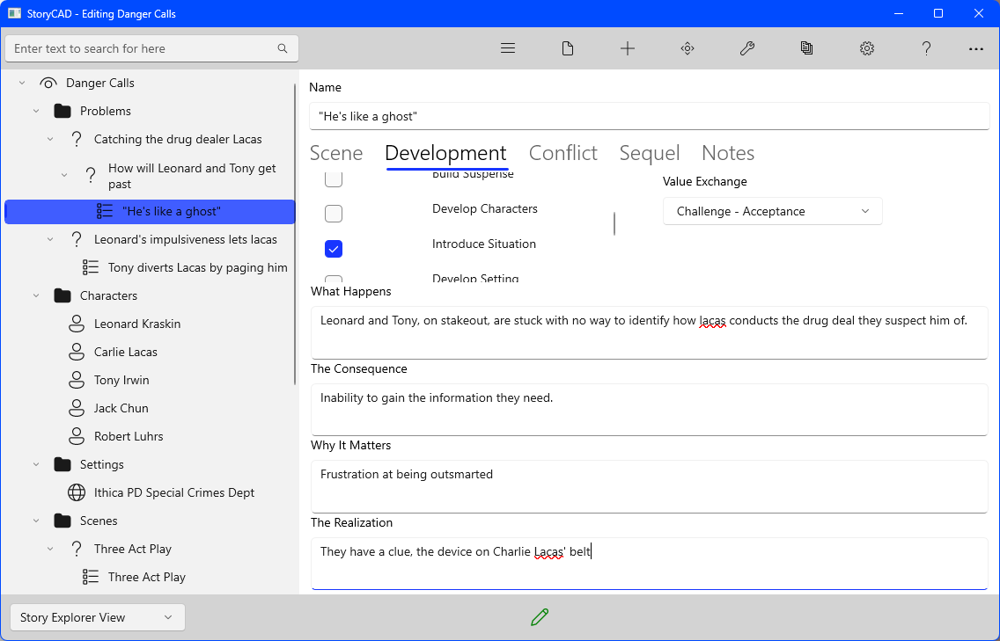
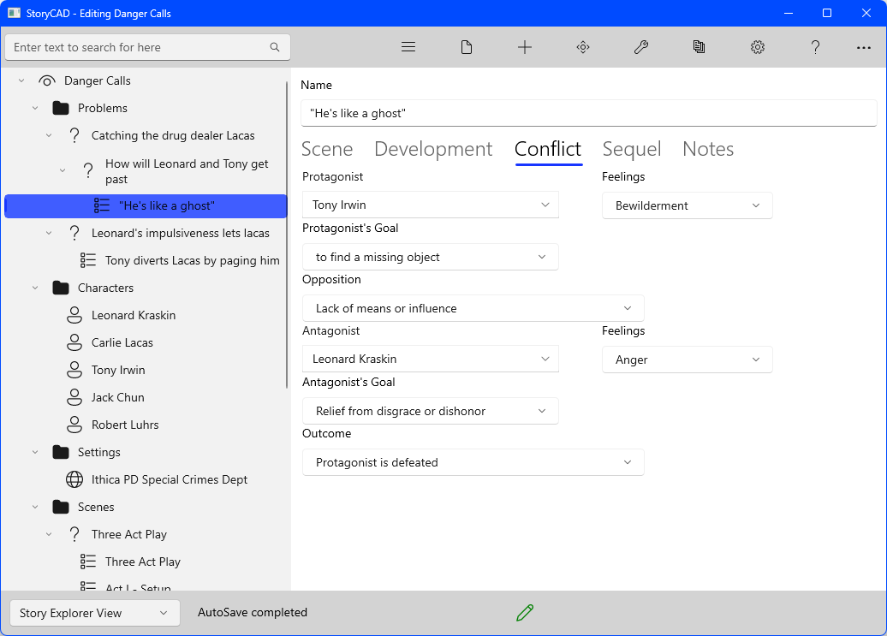
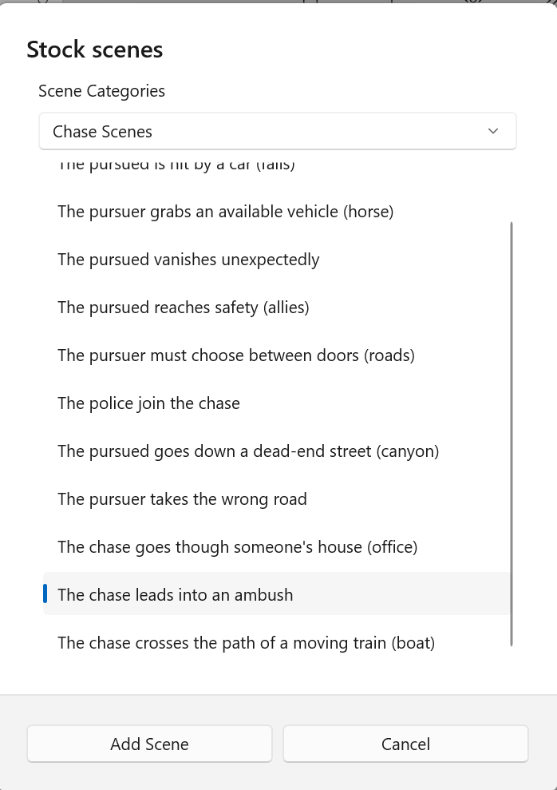
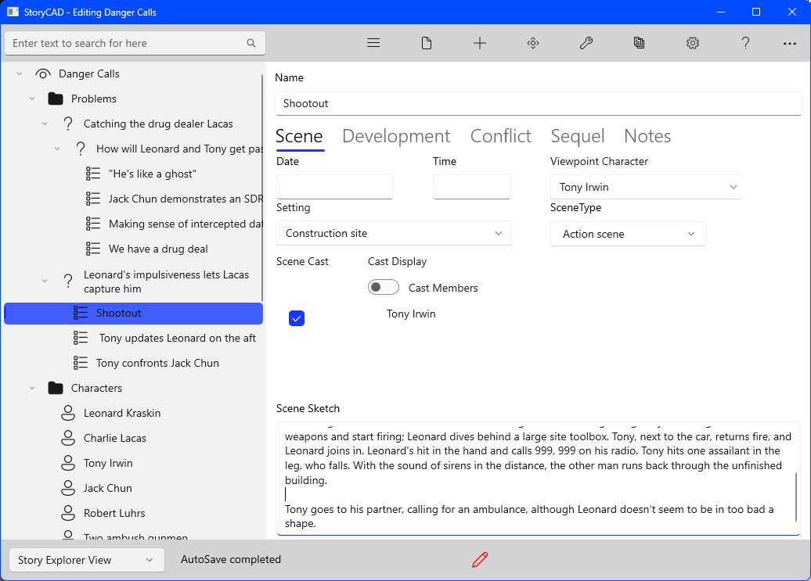

## Creating a Story pt 8
Having developed the characters better, we can return to the plot.  So far we have a skeleton plot, created with the Master Plots tool, and have added a couple of specific scenes, an opening scene and a climax. Our goal is to replace the rest of the skeleton plot points with specific scenes, not in count but in content and shape. Having a beginning and an ending is a good start. Every story is a journey. Of course, you're not bound to follow the skeleton, but our goal here is to illustrate StoryCAD's tools.  

Let’s return to our opening scene (‘He’s like a ghost’) for a moment. .  Both scenes and problems are miniature stories in their own right. The Scene form contains several tabs, Development and Conflict, that address what might be called ‘intra-scene plotting.’  Here’s the use of the Development tab:

 Every scene in the story should have conflict or suspense, and this one is no exception:

Our initial thought was that the conflict was between Tony (or Leonard) and Charlie Lacas, but since Lacas isn’t present in the scene (even though he’s the focus of it), the scene's conflict has to between Leonard and Tony, the ones who are there.  Conflict doesn’t have to be a fight, it’s any kind of opposition to your character’s goals or values. On the Problem form there’s a tool, Conflict Builder, which affords various types of conflict, but at the scene level, a property, Value Exchange, addresses this more subtly.  Our choice, Challenge - Acceptance, implies a choice to try to find a solution to their lack of information, and that in turn suggest a conflict: the alternative is Challenge - Refusal, giving up. The conflict in this scene, then, can be a difference in approach, mirrored in their feelings. 

The next point in the skeleton is 'Present Problem to be Solved'.   Since we've worked over the problems, we know what the problem is--- the Story Question for our first, external problem: 'How can Leonard and Tony overcome the 'cellular phone advantage' and find out where Charlie Lacas' next drug deal will be held, so that they can catch him?' 

All we need to do is to change the skeleton plot point into one which presents this problem.  We can let Leonard present it to the reader, by discussing Lacas' use of technology. A single scene can, and should, serve multiple purposes.

There are other tools to help you plot- for example, Stock Scenes:

Stock Scenes are exactly what their name implies: scenes that you’ve seen so often you recognize them instantly.   We used ‘The chase leads into an ambush’ as the setup to our ‘Leonard's impulsiveness lets Lacas capture him’ problem.
We didn’t call it that, of course, and in fact the capture idea we started with didn’t work: capture implies escape, and it just didn’t fit. Instead, our ‘The chase leads into an ambush became this:

Although the Scene Type we selected was ‘Action scene’, this is actually the Climax. If we go back to our Master Plots Three Act Play, we’ll find one more piece:

We’ve added two scenes after Shootout, ‘Tony updates Leonard on the aftermath’ and ‘Tony confronts Jack Chun’, both of which constitute the denouement for our story. The  confrontation scene, we think, closes a plot hole, how the bad guys came to set up the ambush, namely, a double-cross by Chun. The Problem, ‘Leonard’s impulsiveness lets Lacas capture him’, turns out not to be the second problem all.  ‘Jack Chun double-crosses the detectives.’  Might be a better title, and one question to address is why the double-cross: the question of motive. 

These changes, in the climax scene, Shootout, and a better understanding of the second sub-problem, are typical of what occurs when you’re plotting in scenes. Your story, whether a novel or a short story or an episodic television script, is a series of events which are process the problems your protagonist is trying to solve, and which are linked by cause and effect. Understanding your problems, and using story structure, are the workflow that drives your plotting process.

Danger Calls is melodramatic and its characters aren’t as well drawn as they should be, but this exercise has been meant to show how an idea can evolve via a repeatable process into a workable story outline, and how StoryCAD can help you do that. The following section of the manual, Writing with StoryCAD, elaborates on this process, but the best way to learn is to do, making your own mistakes and solving your own problems. We hope StoryCAD helps you in your writing journey.

