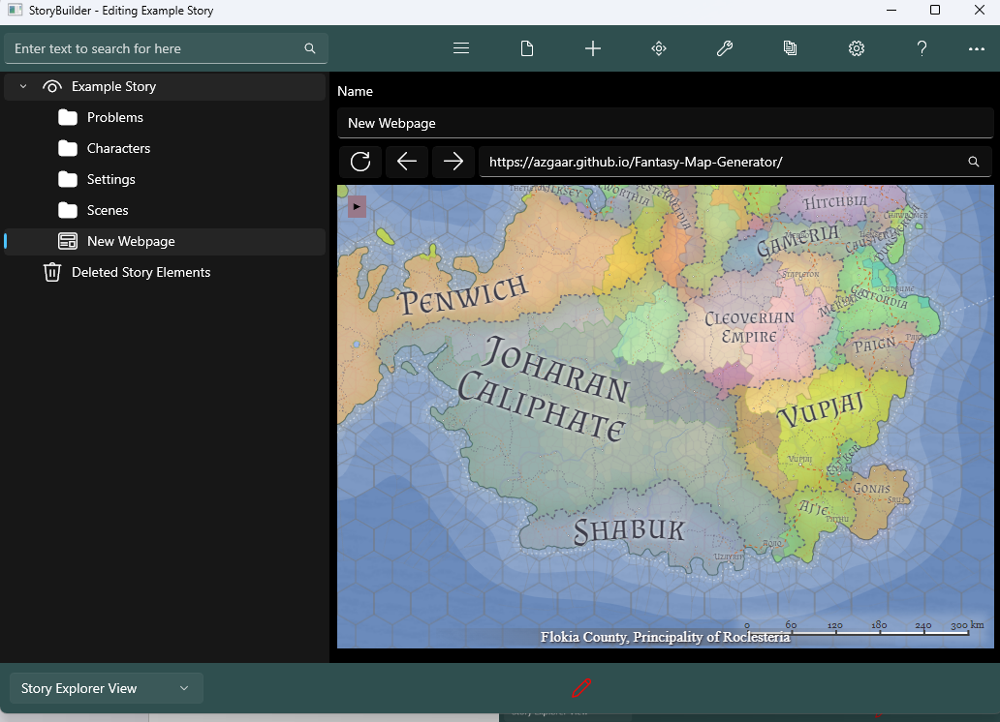

## Website Form ##
Website Form  
The website form allows you store and view web pages easily and functions like a 			smaller version of your web browser. The URL you’re browsing is kept in the form.  

These buttons allow you to refresh, go forwards and respectively.  

This is the search bar, if you have a website link (URL) then you can paste it here and 		after clicking the search button it will load the website. Conversely if you don’t have a 		URL you can search a query such as a map of the world and it will search it using   
Google.  

Example -  Planning out a fictional character.  

1) Create a new website node, you can do this by right clicking a node and  then clicking then clicking the webpage icon.  

2) Now navigate to it by clicking on it, it should now look similar the picture below.  

3) Now lets make a fictional map, so search below fictional map generator.  

3) Select any website below, for this example we will use the first one.  

Congrats, we have now got a map our fictional word and can start planning our story 		around this world  

Note: The Website Form requires the Microsoft Edge WebView 2 runtime, most 				Windows computers will already have this installed by default however if you are for 		any reason missing it, StoryCAD will ask to automatically install it.  

