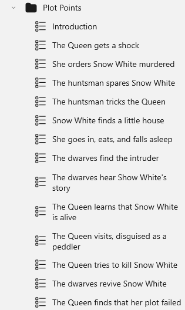
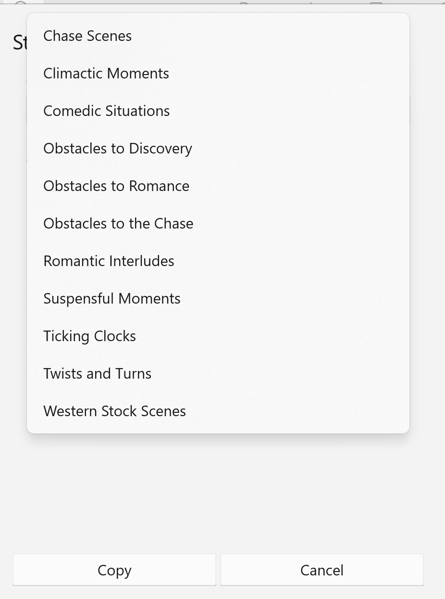

## Plotting Tools

StoryCAD comes with three tools to help you plot your story.

MasterPlots

In recent decades, the three-act structure has been joined by a bevy of other story structures, with different plot points:  Dan Wells’ Seven Point Structure, The Hero’s Journey, Blake Snyder’s Save the Cat, and many more.  Since plot points are also called story beats, these structures are often called ‘beat sheets’. A beat sheet can serve as a sort of plot template. StoryCAD’s Master Plots tool provides a number of these templates, which will insert a set of Scene story elements into your outline at the place of your choosing:

Since every Problem is a 'small story' and has its own set of events that define it, a Problem is good place to use this tool. A Problem can be thought of as a sequence, a term used frequently in scriptwriting, which is defined as ‘a series of scenes with a beginning, middle, and end.’ Or, if you prefer, setup, development, and resolution. 

Here’s what using the Three Act Play will do if you add it after a problem:

These are not scene summaries; it’s up to you to outline the scene itself, and the process will be described a little later. These are plot points, or story beats.  Master Plots populates the template scene’s Notes tab with what should happen at that point in the template. The actual scenes might start off like this:

StoryCAD won’t create these scenes for you (although the next topic, Plotting with StoryCAD, can help you. For help in how to do so, MasterPlots  created one Scene story element for each plot point, which suggests that a scene can do only one thing. That’s far from the truth; a scene can and usually should do multiple things: introduce or develop character, advance the plot, etc. The Scene story element’s Development tab contains a field, Purpose of Scene, which includes many of these purposes (not surprisingly related to the Notes in a Scene generated by MasterPlots.) Purpose of Scene is different from most controls in that you can check off multiple purposes. 

Dramatic Situations

The Dramatic Situations tool, based on Polti’s and Figgis’ books (both titled The Thirty-Six Dramatic Situations), lists a set of situations with roles in opposition and uncertain outcomes- which is to say, situations with built-in drama and conflict:

Although the world has changed greatly since Polti’s 1895 book,  the situations remain relevant, because they’re very  human situations. Mike Figgis recommends using loose rather than literal interpretations of the situations. He points out that these 36 situations work for both outer and inner problems and at varied scales: Disaster, one of the situations, ‘can be a war or an earthquake or the sinking of the Titanic’, but also  ‘in a more intimated love story, it could be a case of unrequited love, the loved one marries another person, a personal disaster of the highest magnitude.’

StoryCAD’s adjusts to scale by allowing you to select a dramatic situation as either a Problem or a Scene story element:

Frequently, a Dramatic Situation is both Problem and Scene (usually the climax.). For example: courtroom drama is a case of Supplication, and in To Kill a Mockingbird,  Atticus Finch’s defense of Tom Robinson is the Story Problem and the courtroom scene (but not the climax.) Basing the central story problem on a Dramatic Situation s is discussed at length in Story Structure Architect, by Victoria Schmidt (Writer’s Digest Books, 2005.) And of course any Problem can be thought of as a sequence, a series of scenes.  Stories are in a sense recursive: A story’s Story Problem can decompose into a series of Problems, each of which is a smaller story with its own setup, complication, and resolution. In turn, each Problem can be decomposed into a sequence, a series of Scenes, each of which is also a little story, typically with setup, complication, and resolution. And in fact, scene outcomes and problem outcomes are often complications for the story problem, with bad endings making things worse for the protagonist.

Mike Figgis suggests a different use for the Dramatic Situations: as an aid when you’re stuck in constructing a plot. Pick one of the 36 situations at random and insert it at the place where you’re stuck. As he puts it, “Chance has always been my friend.”

Stock Scenes

Another StoryCAD tool, Stock Scenes, lists a number of categories of scenes:

Each of these categories contains a number of scenes examples:

Unlike Dramatic Situations, this tool works just with Scenes. One use is to help develop Master Plot plot points / story beats. For example,  the Climatic Moments category can suggest Resolution examples, Ticking Clocks can suggest scenes that ratchet up drama, Obstacles to the Chase (or Discovery, or Romance) can be a Pinch Point, and so forth. As with all examples, if you use it, own it, make it yours. Be specific.

